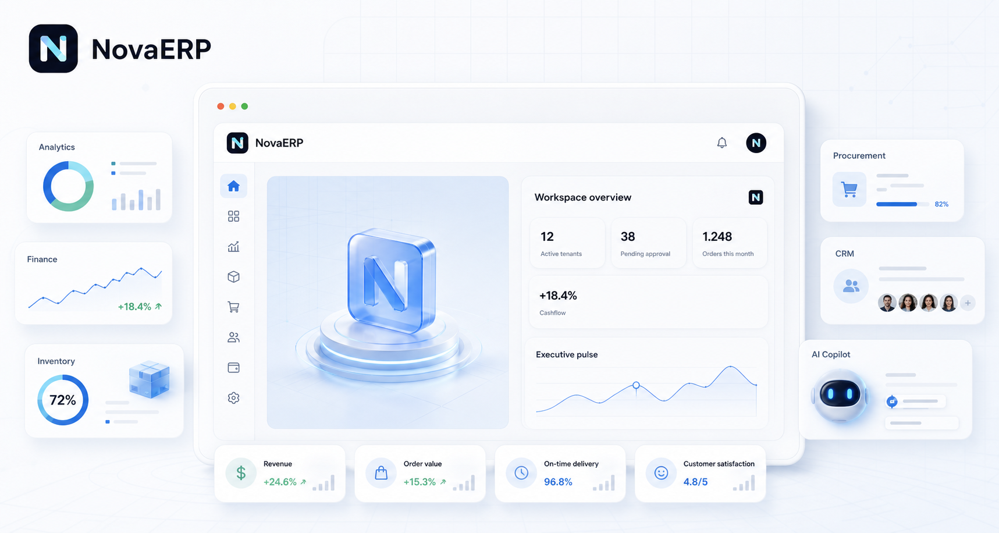

# NovaERP

<p align="center">
  
</p>

NovaERP is a multi-tenant enterprise SaaS ERP platform designed as a modular product foundation for operations, procurement, inventory, sales, finance, HR, manufacturing, analytics, documents, AI, automation, integrations, and executive dashboards.

This branch is a dedicated NovaERP delivery branch inside the shared [`RianEK0/project`](https://github.com/RianEK0/project) portfolio repository.

## Overview

NovaERP was built to showcase how a modern ERP can feel clean, fast, and extensible without losing enterprise depth.

The project combines:

- a role-aware SaaS shell,
- a modular monorepo architecture,
- a NestJS API with Prisma and PostgreSQL,
- a Next.js application with a polished enterprise UI,
- AI workspace patterns for safe query, summaries, recommendations, OCR, and guided actions,
- enterprise platform concepts such as multi-company control, extensibility, auditability, and workflow orchestration.

## Product Scope

The current implementation covers a broad foundation across these product areas:

- Core platform: authentication, refresh sessions, RBAC, memberships, organizations, workspaces, settings, notifications, and audit logs.
- Booking and service operations: customer management, services, resources, availability, pricing, promotions, invoicing, payments, and booking analytics.
- Product and inventory foundation: categories, brands, variants, barcodes, warehouses, zones, storage locations, inventory balances, lots, serials, reservations, reorder rules, and alerts.
- Warehouse operations: goods receipt, goods issue, stock transfer, stock adjustment, putaway, picking, packing, dispatch, stock count, and scanning foundations.
- Procurement: purchase requests, approvals, RFQ, supplier quotations, vendor comparison, purchase orders, purchase contracts, receipts, invoice preparation, and vendor performance signals.
- CRM and sales: leads, opportunities, deals, activities, communications, quotations, pipelines, customer timelines, order-to-cash, shipments, returns, credit notes, discount and tax engines, customer credit, installments, and sales analytics.
- Customer portal: dashboard, bookings, orders, invoices, payments, support, downloads, notifications, profile, and tracking routes.
- Finance and accounting: chart of accounts, general ledger, journals, vouchers, banks, cash, budgets, cost centers, fiscal years, currencies, exchange rates, assets, depreciation, and financial statements.
- HR and people operations: employees, departments, attendance, leave, payroll, shifts, recruitment, performance, training, KPI, and organization chart foundations.
- Manufacturing: bill of materials, routing, production, work orders, machines, maintenance, quality control, scrap, MRP, and capacity planning starters.
- Analytics and BI: domain analytics, entity intelligence, semantic modeling, realtime analytics, self-serve dashboard builder, and report builder.
- Documents workspace: PDF, Word, Excel, contracts, invoices, SOP, manuals, training, and policy lanes.
- AI workspace: AI Copilot, Chat ERP, Ask Inventory, Ask Finance, Ask CRM, natural-language search, AI reports, forecasting, recommendations, OCR, document review, voice assistant, and meeting summary flows.
- Automation and orchestration: approval flow, triggers, conditions, actions, reminders, webhooks, channel automation, cron previews, workflow builder, and rule engine patterns.
- Integrations: payments, productivity suites, messaging, storage, and AI providers.
- Executive and domain dashboards: executive, CEO, finance, inventory, warehouse, sales, CRM, HR, and manufacturing dashboard workspaces.
- Mobile and device workspace: PWA, offline sync, barcode, QR, camera, GPS, push notifications, dark mode, tablet UI, and warehouse UI.
- Enterprise platform controls: multi-company, multi-branch, multi-warehouse, multi-currency, multi-language, white-label, theme builder, plugin system, extension SDK, audit center, compliance, SSO, OAuth, SAML, enterprise cloud, DevOps, enterprise security, public API, and NovaOS workbenches.

## Tech Stack

### Frontend

- Next.js App Router
- React 19
- TypeScript
- Tailwind CSS
- TanStack Query
- React Hook Form
- Zustand
- Zod

### Backend

- NestJS
- Prisma
- PostgreSQL
- Redis-ready session and permission caching approach
- Modular monolith architecture

### Tooling

- pnpm workspaces
- Turborepo
- ESLint
- Prettier
- Husky
- GitHub Actions

## Repository Structure

```text
.
├── apps
│   ├── api        # NestJS API
│   └── web        # Next.js frontend
├── docs           # Product, API, architecture, ADR, and database documentation
├── infrastructure # Docker and environment support files
├── packages       # Shared UI, types, validation, config
├── prisma         # Prisma schema, migrations, and config
└── scripts        # Local development helpers
```

## Local Development

### Prerequisites

- Node.js 20+
- pnpm 10+
- PostgreSQL
- Optional local infrastructure through Docker Compose

### Install

```bash
pnpm install
```

### Environment

```bash
cp .env.example .env
```

Update your database connection and any local service configuration inside `.env`.

### Database

```bash
pnpm db:generate
pnpm db:push
pnpm db:seed
```

### Run the project

```bash
pnpm dev
```

By default:

- Web app: `http://localhost:3000`
- API: `http://localhost:4000/api/v1`
- Swagger: `http://localhost:4000/api/docs`

### Optional Docker workflow

```bash
pnpm docker:up
pnpm docker:down
```

## Demo Accounts

Local development seeds include the following demo users:

- `superadmin@novaerp.local`
- `owner@novaerp.local`
- `manager@novaerp.local`
- `staff@novaerp.local`
- `viewer@novaerp.local`
- `admin@novaerp.local`

Development password:

```text
NovaERP@123
```

Use these accounts for local testing only.

## Useful Commands

```bash
pnpm dev
pnpm build
pnpm lint
pnpm typecheck
pnpm test
pnpm test:e2e
pnpm db:generate
pnpm db:push
pnpm db:seed
```

## Quality Checks

The main verification flow for this project is:

```bash
pnpm lint
pnpm typecheck
pnpm test
pnpm build
```

## Documentation

Detailed project references are already included in the repository:

- `docs/architecture.md`
- `docs/modules.md`
- `docs/roadmap.md`
- `docs/api/`
- `docs/architecture/`
- `docs/database/`
- `docs/decisions/`

## Current Status

NovaERP is already strong as a portfolio-grade enterprise SaaS foundation, especially for:

- multi-tenant product architecture,
- domain breadth across ERP modules,
- UI system consistency,
- AI-assisted operational surfaces,
- enterprise-oriented platform thinking,
- documentation depth.

Some modules are still intentionally presented as foundations, workbenches, and controlled previews rather than full production workflows. That is part of the design: the branch demonstrates architecture quality, extensibility, and product direction at scale.

## License

MIT
