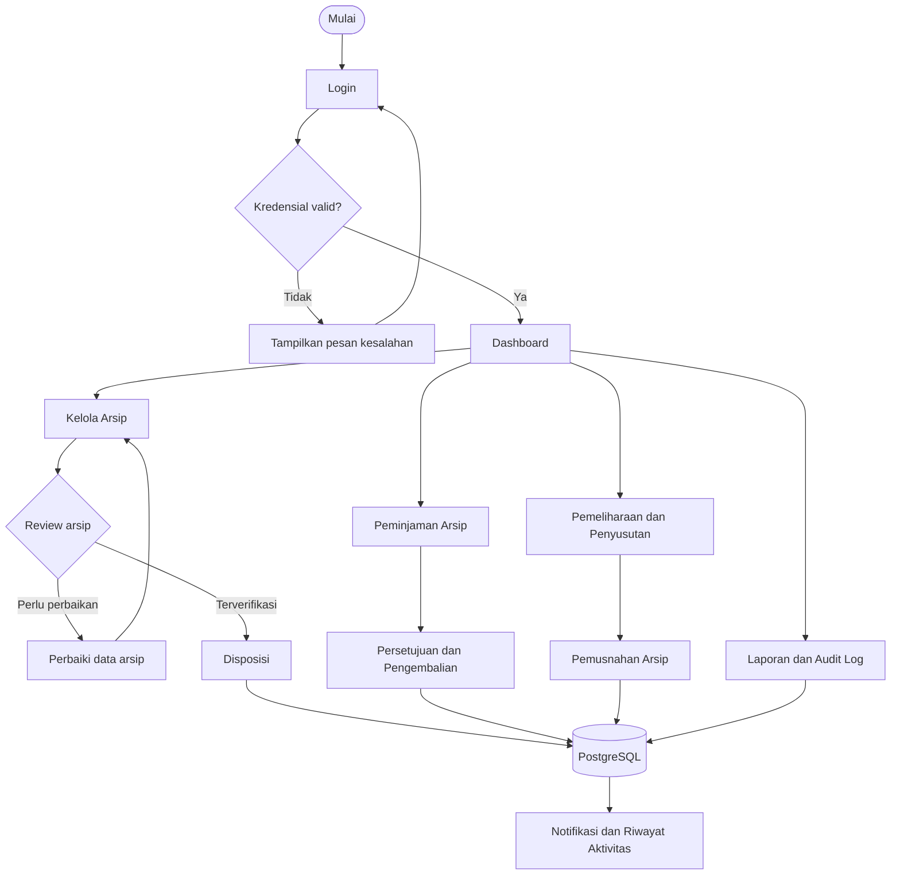
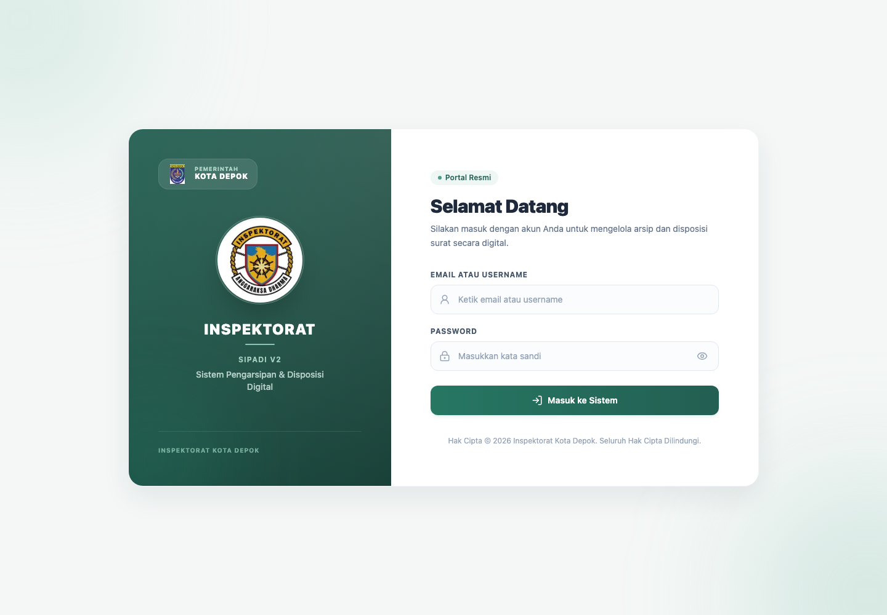
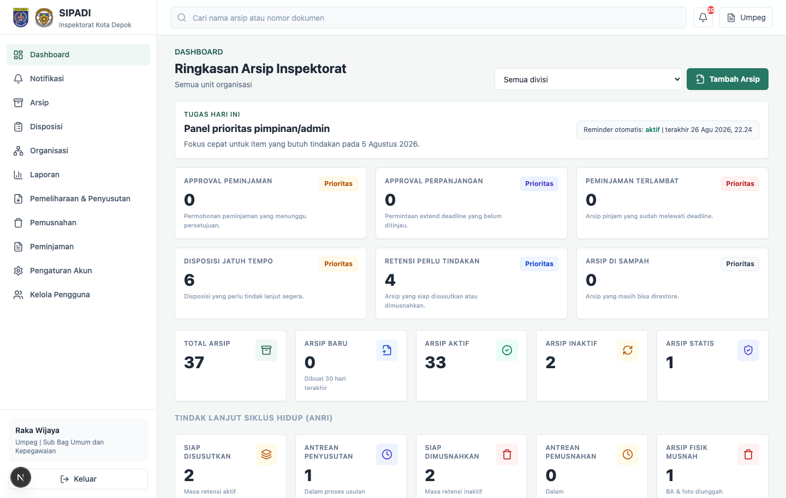
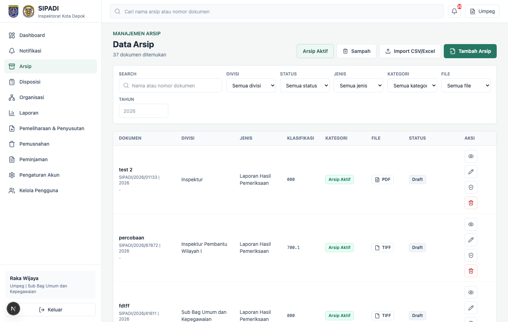

# SIPADI

SIPADI adalah aplikasi web fullstack untuk **Sistem Pengarsipan dan Disposisi Inspektorat**. Aplikasi ini dirancang agar bisa dikembangkan dari laptop pribadi tanpa bergantung pada jaringan lokal kantor, lalu siap dipisah deploy ke Vercel, Render/Railway, dan Supabase PostgreSQL.

Data di repo ini seluruhnya dummy.

## Teknologi

- Frontend: Next.js, React, Tailwind CSS
- Backend: Node.js, Express.js
- Database: PostgreSQL
- Auth: JWT dengan password hashing `bcryptjs`
- Upload: local storage di `apps/api/uploads`
- Export laporan: PDF dan Excel
- Target deploy: Vercel frontend, Render/Railway backend, Supabase database

## Flowchart Aplikasi



Dokumentasi use case, activity diagram, sequence diagram, dan ERD tersedia di [Dokumentasi Diagram SIPADI](./sipadi_diagrams.md).

## Tampilan Aplikasi

Seluruh data yang terlihat pada screenshot berikut merupakan data pengembangan/dummy.

### Halaman Login



### Dashboard



### Manajemen Arsip



## Struktur Folder

```text
.
├── apps
│   ├── api
│   │   ├── db
│   │   │   ├── migrate.js
│   │   │   ├── schema.sql
│   │   │   └── seed.js
│   │   ├── src
│   │   │   ├── config
│   │   │   ├── middleware
│   │   │   ├── routes
│   │   │   ├── services
│   │   │   ├── utils
│   │   │   └── server.js
│   │   └── uploads
│   └── web
│       ├── app
│       │   ├── (app)
│       │   └── login
│       ├── components
│       └── lib
├── docker-compose.yml
└── package.json
```

## Database Schema

Tabel utama:

- `organization_units`: 11 unit organisasi.
- `users`: user dummy dengan role Admin, Inspektur, Sekretaris, Sub Bag, Irban Wilayah, Staff.
- `archives`: arsip dokumen, status, tipe file, metadata upload, verifikasi.
- `archive_comments`: komentar arsip.
- `dispositions`: disposisi dokumen, tujuan user/unit, catatan, deadline, status.
- `disposition_history`: riwayat perubahan disposisi.
- `audit_logs`: log aktivitas user.

Schema lengkap ada di `apps/api/db/schema.sql`.

## Seed Data

Seeder membuat:

- 10 user
- 11 unit organisasi
- 30 arsip
- 10 disposisi
- 20 aktivitas audit

Akun login utama:

```text
admin@sipadi.test
nilai SEED_DEFAULT_PASSWORD
```

Seed bersifat destructive dan hanya untuk development. Jalankan hanya dengan `ALLOW_DESTRUCTIVE_SEED=true` dan isi `SEED_DEFAULT_PASSWORD` secara eksplisit; tidak ada fallback password hardcoded. Semua user hasil seed dipaksa mengganti password awal sebelum memakai fitur SIPADI.

## Cara Menjalankan Lokal

1. Install dependency.

```bash
npm install
```

2. Siapkan file environment.

```bash
cp apps/api/.env.example apps/api/.env
cp apps/web/.env.example apps/web/.env.local
```

3. Jalankan PostgreSQL lokal dengan Docker.

```bash
docker compose up -d
```

Jika sudah punya PostgreSQL lokal, gunakan database sendiri dan set `DATABASE_URL`, misalnya:

```text
DATABASE_URL=postgresql:///sipadi
```

4. Terapkan schema dan seed dummy.

```bash
npm run db:schema
npm run db:seed
```

5. Jalankan frontend dan backend.

```bash
npm run dev
```

URL lokal:

- Frontend: `http://localhost:3000`
- Backend: `http://localhost:4000/api`
- Health check: `http://localhost:4000/api/health`

## API Endpoint

Auth:

- `POST /api/auth/login`
- `GET /api/auth/me`

Dashboard:

- `GET /api/dashboard`

Arsip:

- `GET /api/archives`
- `POST /api/archives`
- `GET /api/archives/:id`
- `PUT /api/archives/:id`
- `DELETE /api/archives/:id`
- `POST /api/archives/:id/comments`
- `POST /api/archives/:id/verify`
- `GET /api/archives/:id/download`

Disposisi:

- `GET /api/dispositions`
- `POST /api/dispositions`
- `GET /api/dispositions/:id`
- `PATCH /api/dispositions/:id/status`
- `DELETE /api/dispositions/:id`

Organisasi:

- `GET /api/organization`
- `GET /api/organization/users`

Laporan:

- `GET /api/reports/archives`
- `GET /api/reports/archives/export?format=pdf`
- `GET /api/reports/archives/export?format=xls`

Audit log:

- `GET /api/audit-logs`

User management:

- `GET /api/users`
- `POST /api/users`
- `PUT /api/users/:id`
- `DELETE /api/users/:id`

## Deploy Cloud

### Supabase PostgreSQL

1. Buat project Supabase.
2. Ambil connection string PostgreSQL.
3. Set `DATABASE_URL` backend ke connection string Supabase.
4. Jalankan schema dan seed dari laptop:

```bash
DATABASE_URL="postgresql://..." npm run db:schema
DATABASE_URL="postgresql://..." npm run db:seed
```

### Backend di Render atau Railway

Set environment:

```text
NODE_ENV=production
PORT=4000
DATABASE_URL=postgresql://...
JWT_SECRET=secret-produksi-yang-panjang
JWT_EXPIRES_IN=8h
FRONTEND_URL=https://domain-frontend.vercel.app
UPLOAD_DIR=uploads
MAX_FILE_SIZE_MB=10
```

Build command:

```bash
npm install
```

Start command:

```bash
npm run start --workspace @sipadi/api
```

Catatan upload: local storage cocok untuk development. Saat production, ganti adapter upload di `apps/api/src/middleware/upload.js` ke Supabase Storage atau Cloudinary agar file tidak hilang saat instance backend restart.

### Frontend di Vercel

Set root project ke repo ini dan environment:

```text
NEXT_PUBLIC_API_URL=https://domain-backend.onrender.com/api
```

Build command:

```bash
npm run build --workspace @sipadi/web
```

Output mengikuti standar Next.js di Vercel.

## Security Yang Sudah Disiapkan

- Password baru minimal 12 karakter, memakai huruf besar, huruf kecil, dan angka; hash baru menggunakan bcrypt cost 12.
- Akun baru dan password yang direset wajib diganti oleh pemilik akun; password saat ini dan lima password sebelumnya tidak dapat dipakai ulang.
- Auth JWT dibatasi ke algoritma HS256, issuer, audience, expiry, `jti`, `auth_time`, dan `token_version`. Setiap sesi dicatat server-side memakai hash ID, dapat dilihat/dicabut oleh pemilik, dan langsung dicabut saat password, role, unit, status akun, MFA, atau passkey berubah.
- Sesi memiliki batas absolut 8 jam, idle timeout server-side 30 menit, dan maksimum tiga sesi aktif secara default. Pengguna dapat mencabut satu perangkat atau semua perangkat lain setelah mengonfirmasi password.
- Percobaan login dibatasi per kombinasi IP dan akun. Penghitung kegagalan dan masa lockout disimpan di database sehingga tidak dapat dilewati dengan mengganti IP atau me-restart API.
- Sesi browser menggunakan cookie `HttpOnly`, `SameSite=Strict`, `Secure` pada production, serta pemeriksaan Origin/Fetch Metadata untuk menolak mutasi lintas situs; token tidak tersedia bagi JavaScript browser dan tidak dikirim melalui query string SSE.
- Passkey WebAuthn dengan user verification wajib tersedia dan menjadi persyaratan role `Admin`/`Inspektur` pada production; TOTP dan recovery code tetap didukung sebagai faktor terkelola.
- Reset MFA, membuka akun terkunci, pengelolaan akun istimewa, ekspor backup, dan restore memakai WebAuthn step-up langsung di dalam sesi. Challenge sekali pakai terikat ke user, ID sesi, dan jenis operasi; verifikasi berhasil merotasi ID sesi serta hanya memberi izin untuk operasi tersebut selama `PRIVILEGED_REAUTH_MAX_AGE_MINUTES`.
- Probe SQL injection, XSS, command injection, path traversal, dan akses honeypot dicatat sebagai insiden; sumber berulang diblokir sementara.
- Pusat Keamanan untuk Admin/Inspektur menampilkan event, IP yang sedang diblokir, tingkat keparahan, dan alur review insiden.
- Audit log baru bersifat append-only dan tamper-evident: HMAC hash chain, key ID/rotasi, advisory lock, verifikasi integritas, serta trigger yang menolak insert unsigned, rantai terputus, update, delete, dan truncate.
- Endpoint readiness/Prometheus dipisah dari health check publik dan dilindungi token internal; URL 404 dikumpulkan tanpa label attacker-controlled.
- File arsip, spreadsheet impor, dan backup restore dapat dipindai oleh ClamAV sebelum diproses. Production menggunakan mode fail-closed.
- Stack produksi berlapis OWASP ModSecurity CRS (WAF), jaringan container privat, ClamAV, PostgreSQL privat, log SIEM-ready, dan konfigurasi Fail2ban.

Panduan menjalankan deployment anti-hack tersedia di [`deploy/ANTI_HACK.md`](deploy/ANTI_HACK.md). Gunakan `docker-compose.security.yml` untuk stack production; `docker-compose.yml` tetap dipertahankan sebagai PostgreSQL development lokal.

- Paket kesiapan pemerintah, threat model, matriks kontrol SMKI/SPBE, tata kelola data, runbook, register, dan gerbang go-live tersedia di [`docs/government/README.md`](docs/government/README.md).
- Workflow rilis membuat CycloneDX SBOM, checksum SHA-256, dan GitHub/Sigstore artifact attestation dari action yang dipin ke commit immutable; panduan verifikasi ada di [`deploy/supply-chain/README.md`](deploy/supply-chain/README.md).
- Role-based access control di endpoint sensitif.
- Daftar, dashboard, laporan, dan proses penyusutan dibatasi ke arsip unit sendiri, arsip buatan sendiri, atau arsip dengan pinjaman yang disetujui; role global tetap dapat mengakses lintas unit.
- File arsip bisa dipratinjau dan diunduh dari detail arsip oleh user yang memiliki akses; dokumen `Rahasia` tetap view-only.
- Edit dan hapus arsip hanya untuk Admin, Inspektur, Sekretaris, atau role `Sub Bag`/`Irban Wilayah` pada unit arsipnya.
- Perubahan status arsip hanya untuk Admin, Inspektur, Sekretaris, atau role `Sub Bag`/`Irban Wilayah` pada unit arsipnya.
- Pembuatan disposisi hanya untuk role dengan akses global.
- Validasi input dengan `zod`.
- Validasi upload mencakup extension, MIME, ukuran, signature/magic bytes, nama acak, dan pencegahan path traversal.
- Backup dan restore data penuh hanya tersedia untuk role `Admin`.
- `helmet`, CSP, anti-framing, `nosniff`, referrer policy, permissions policy, request ID, dan log request yang dinetralisasi.
- CORS memakai allowlist `FRONTEND_URL`; origin localhost tidak otomatis dibuka pada mode production.
- Mode production menolak startup bila database masih memakai kredensial development, secret kosong/placeholder/kurang dari 32 karakter, atau satu secret dipakai untuk lebih dari satu fungsi keamanan.
- Pool PostgreSQL memiliki batas koneksi, connection/query/statement timeout, application name, keepalive, serta mode TLS `disable`, `require`, atau `verify-full`; gunakan `verify-full` dan CA tepercaya untuk database di luar jaringan privat stack.
- Audit dependensi produksi dan development saat ini tidak menemukan vulnerability.

Setelah menarik perubahan keamanan, terapkan tabel registri sesi, riwayat password, dan kolom lockout dengan:

```bash
npm run db:schema
```

Semua sesi lama perlu login ulang karena sesi tanpa registrasi server dan klaim `jti` ditolak.

## Roadmap Pengembangan

Backlog dan prioritas pengembangan lanjutan SIPADI dirangkum di [ROADMAP.md](./ROADMAP.md).

Prioritas yang paling terasa setelah fitur pengembalian peminjaman:

- Reminder jatuh tempo peminjaman
- Perpanjangan peminjaman
- Riwayat peminjaman per arsip
- Inbox notifikasi penuh
- Pengaturan akun
