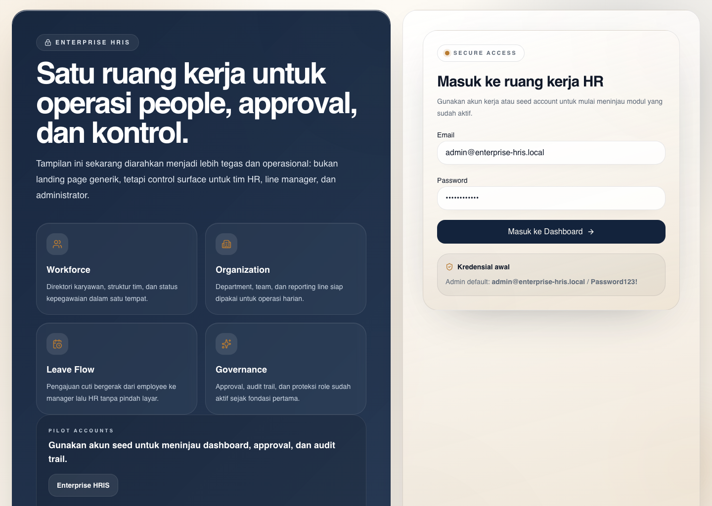
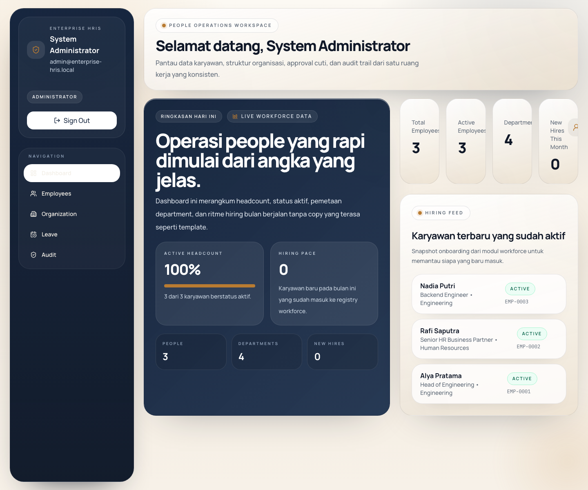
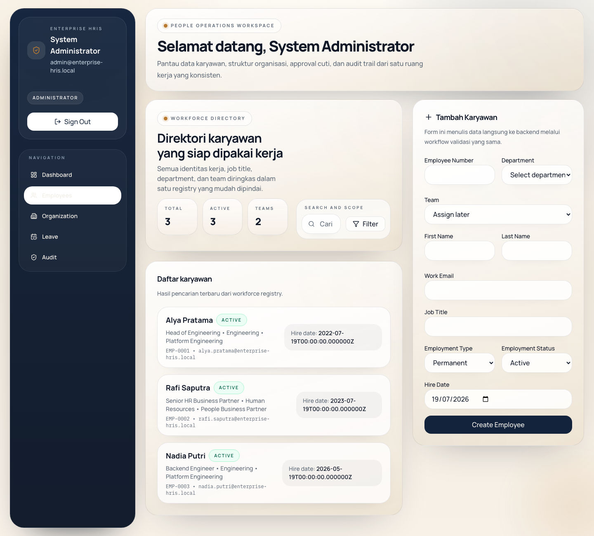
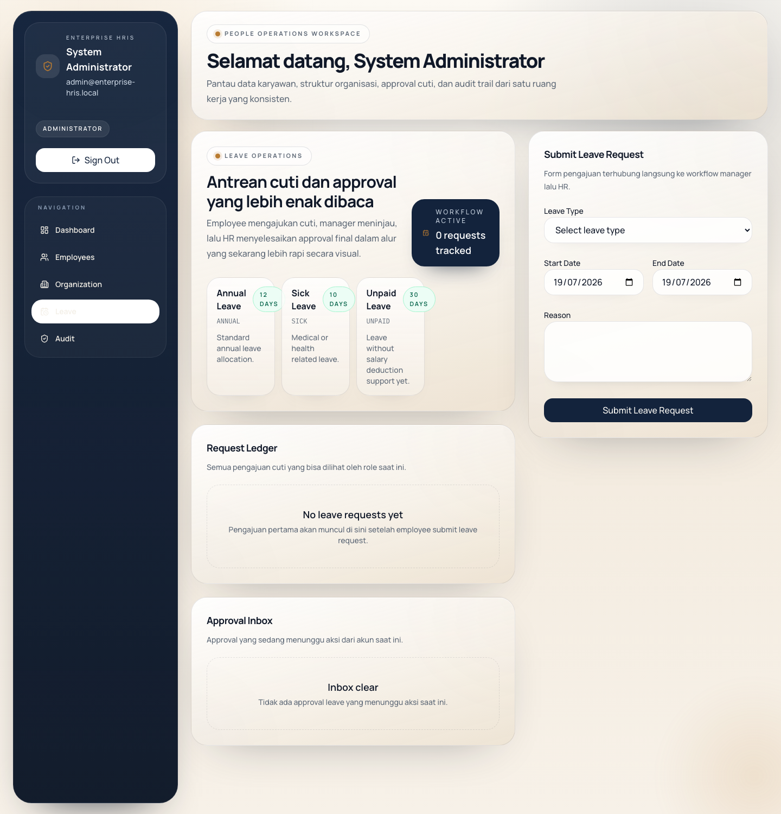
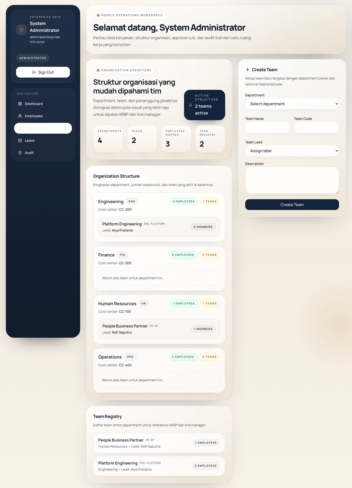

# Enterprise HRIS

Enterprise HRIS is a Human Resource Information System monorepo with a modular Laravel 12 API backend and a React 19 frontend. The repository is designed for enterprise HR operations: modern authentication, RBAC, employee management, organization structure, attendance, leave, payroll, recruitment, performance, IT assets, notifications, executive dashboards, and audit trails.

## Highlights

- Modular backend with a service layer, DTOs, repository contracts, policies, permission middleware, queues, scheduler jobs, events, and notifications.
- React + TypeScript frontend with a feature-based structure for the dashboard and the full HR workspace.
- PostgreSQL, Redis, Mailpit, Nginx, and Docker Compose for both local development and containerized deployment.
- JSON REST API with JWT authentication, refresh tokens, session management, pagination, filtering, sorting, and search.
- Centralized documentation for installation, deployment, API references, ERD, flowcharts, folder structure, and contribution workflow.

## Tech Stack

- Backend: Laravel 12, PHP 8.2+ runtime, JWT Auth, PHPUnit
- Frontend: React 19, TypeScript, Vite, TanStack Query, React Hook Form, Zod
- Database: PostgreSQL
- Cache and Queue: Redis
- Mail Testing: Mailpit
- Web Server: Nginx
- Containers: Docker Compose

## Module Coverage

- Access Control and Security
  - Login, logout, forgot password, reset password, email verification, remember me, multi-device session, refresh token, Google Authenticator 2FA, captcha, lockout, login history, password history
- Workforce
  - Complete employee profiles, document upload, salary and contract history, audit log
- Organization
  - Company, branch, department, division, section, position, manager, reporting line, organization chart
- Attendance
  - Clock in/out, GPS and photo validation, QR attendance, manual attendance, correction, approval, shift, holiday, overtime, report
- Leave
  - Leave type, balance, calendar, request, approval, reminder-oriented workspace
- Payroll
  - Payroll run, approval, payslip, PDF and Excel export, payroll history, adjustment item
- Recruitment
  - Vacancy, candidate, application, interview, assessment, hiring pipeline
- Performance
  - Cycle, KPI/OKR/goal, review, feedback, manager and employee review
- IT Assets
  - Asset registry, assignment, return, maintenance, warranty, QR history support
- Notifications
  - Email, in-app, push-ready, WhatsApp-ready, Slack-ready, Microsoft Teams-ready
- Governance
  - Audit log, executive dashboard, operational timeline

## Screenshots

### Login



### Executive Dashboard



### Employee Management



### Leave Workspace



### Organization Structure



## Monorepo Layout

- `backend`
  Laravel API, business modules, migrations, seeders, tests
- `frontend`
  React application for the dashboard and the complete HR workspace
- `docker`
  PHP-FPM Dockerfile, entrypoint scripts, health checks, and Nginx configuration
- `docs`
  Technical, operational, API, database, and architecture documentation
- `screenshots`
  UI reference screenshots

## Quick Start

### Local Backend

```bash
cd backend
cp .env.example .env
composer install
php artisan key:generate
php artisan jwt:secret
php artisan migrate:fresh --seed
php artisan serve
```

If you also want to run the worker and scheduler locally:

```bash
php artisan queue:work
php artisan schedule:run
```

### Local Frontend

```bash
cd frontend
cp .env.example .env
npm install
npm run dev
```

### Full Stack via Docker

```bash
docker compose up --build
docker compose exec laravel php artisan migrate --seed
```

The frontend is available as an optional profile:

```bash
docker compose --profile frontend up --build
```

## Default Access

- Administrator
  - Email: `admin@enterprise-hris.local`
  - Password: `Password123!`
- HR Manager
  - Email: `rafi.saputra@enterprise-hris.local`
  - Password: `Password123!`
- Department Manager
  - Email: `alya.pratama@enterprise-hris.local`
  - Password: `Password123!`
- Employee
  - Email: `nadia.putri@enterprise-hris.local`
  - Password: `Password123!`

## Useful Endpoints

- API Base URL: `http://localhost:8000/api/v1`
- Laravel Health Endpoint: `http://localhost:8000/up`
- Frontend Dev URL: `http://localhost:5173`
- Mailpit UI: `http://localhost:8025`

## Available Scripts

### Backend

```bash
cd backend
composer test
php artisan test
```

### Frontend

```bash
cd frontend
npm run dev
npm run build
npm run typecheck
npm run lint
```

## Documentation Map

- Documentation Index: [docs/README.md](docs/README.md)
- Installation Guide: [docs/guides/installation.md](docs/guides/installation.md)
- Deployment Guide: [docs/guides/deployment.md](docs/guides/deployment.md)
- Architecture Overview: [docs/architecture/overview.md](docs/architecture/overview.md)
- Folder Structure: [docs/architecture/folder-structure.md](docs/architecture/folder-structure.md)
- Flowchart: [docs/architecture/flowchart.md](docs/architecture/flowchart.md)
- API Documentation: [docs/api/README.md](docs/api/README.md)
- OpenAPI Spec: [docs/api/openapi.yaml](docs/api/openapi.yaml)
- ERD: [docs/database/erd.md](docs/database/erd.md)
- Domain Data Diagram: [docs/database/diagram.md](docs/database/diagram.md)
- Contribution Guide: [CONTRIBUTING.md](CONTRIBUTING.md)

## Notes

- The Docker Compose configuration already includes `laravel`, `nginx`, `postgres`, `redis`, `mailpit`, `queue`, and `scheduler`.
- The Docker binary was not available in the working environment when this documentation was updated on Monday, July 20, 2026, so validation here is limited to file-level and command-level checks rather than live container runtime verification.
