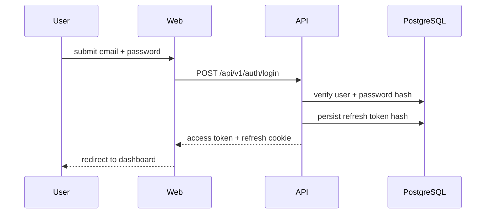
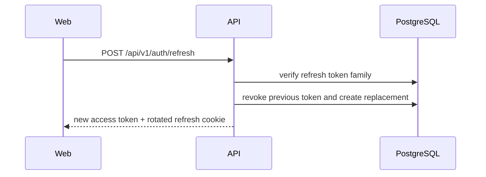

# Authentication

Sprint 1 menggunakan kombinasi access token dan refresh token rotation.

## Principles

- Access token berumur pendek.
- Refresh token disimpan dalam cookie `HttpOnly`.
- Hash refresh token disimpan di database.
- Reuse detection akan merevoke seluruh token family.
- Password di-hash dengan Argon2id.

## Login Sequence

## Refresh Token Sequence

