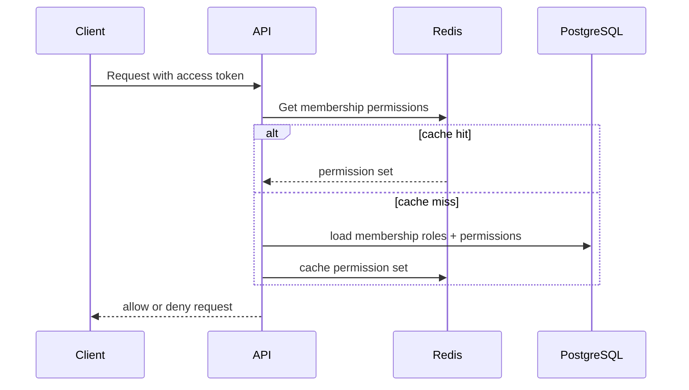

# Authorization

Authorization NovaERP Sprint 1 berbasis permission, bukan sekadar nama role.

## Model

- `Permission`: katalog kemampuan sistem
- `Role`: kumpulan permission
- `MembershipRole`: assignment role ke membership
- `Membership`: representasi user di organization

## Permission Check

## Notes

- Super admin bypass hanya berlaku pada route yang memang diizinkan.
- Perubahan role dan permission wajib menginvalidasi cache.
- Permission guard menerima input seperti `organization:update` atau `membership:remove`.
