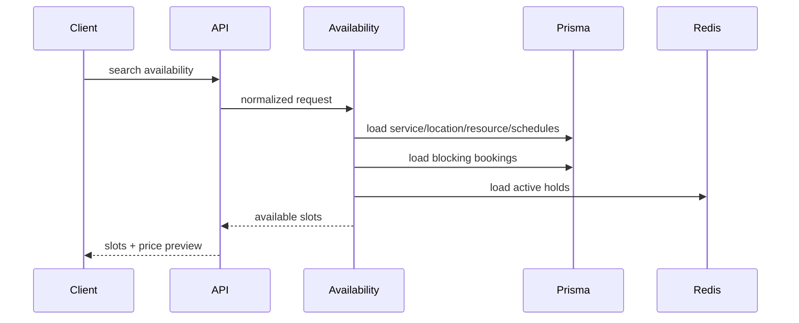

# Availability Engine

Availability engine NovaERP Sprint 2 menentukan apakah suatu slot benar-benar dapat dipakai sebelum booking dibuat.

## Evaluation Order

1. Validasi `organizationId`, `serviceId`, dan tenant scope.
2. Validasi service aktif.
3. Validasi location aktif bila service memerlukan location.
4. Validasi resource aktif bila service memerlukan resource.
5. Muat business hours berdasarkan precedence:
   - resource
   - location
   - organization
6. Terapkan schedule exception untuk tanggal terkait.
7. Terapkan resource blocks.
8. Muat booking aktif yang bersifat blocking.
9. Cek overlap waktu dengan buffer.
10. Cek capacity service dan resource.
11. Bentuk slot yang valid.

## Overlap Rule

```text
existingStart < requestedEnd
AND
existingEnd > requestedStart
```

## Blocking Statuses

- `PENDING_APPROVAL`
- `CONFIRMED`
- `PARTIALLY_PAID`
- `PAID`
- `CHECKED_IN`
- `IN_PROGRESS`

## Output

- slots yang tersedia
- capacity remaining
- resource candidates
- warning bila slot valid tetapi mendekati batas operasional

## Sequence


