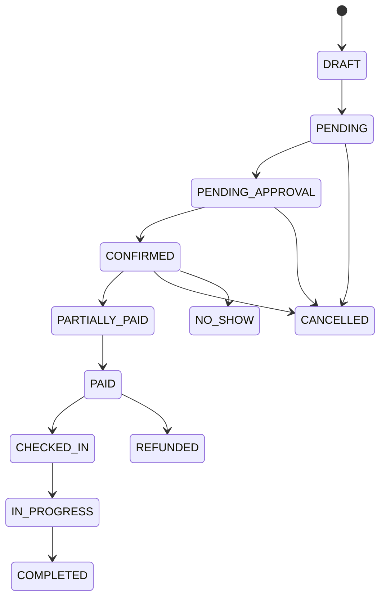

# Booking State Machine

Booking NovaERP Sprint 2 tidak boleh berubah status secara bebas.

## Required Side Effects

Setiap perubahan status harus:

- divalidasi oleh state transition service,
- dicatat di `BookingStatusHistory`,
- dicatat di `AuditLog`,
- menerbitkan domain event internal,
- memperbarui data finansial bila relevan.
