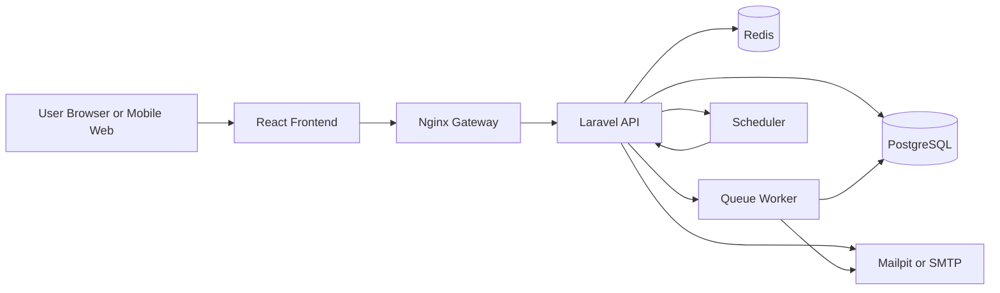
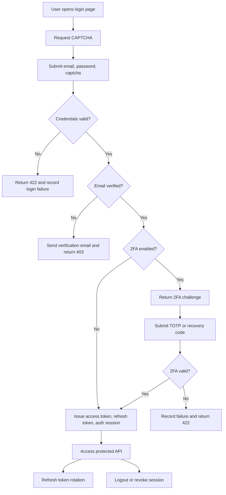
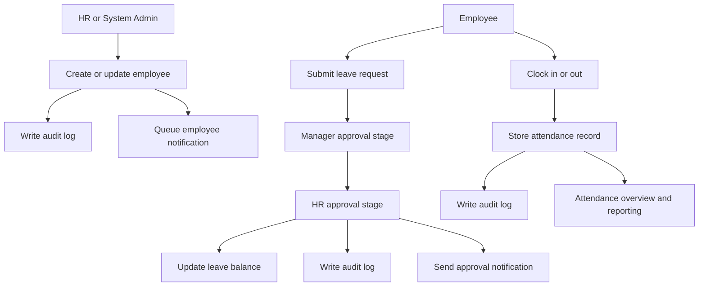
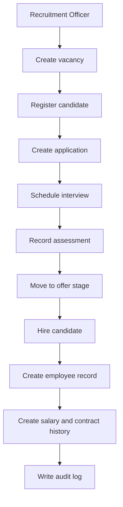
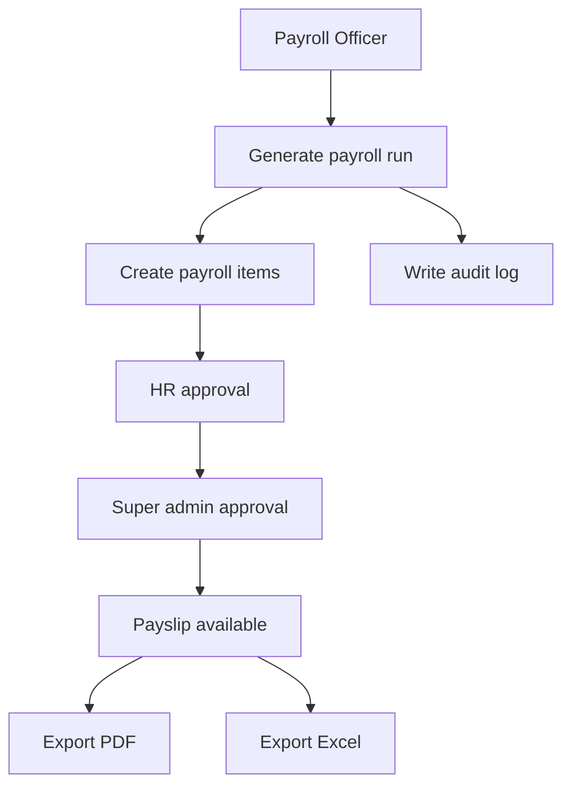

# Flowchart

Dokumen ini merangkum alur sistem utama dalam bentuk Mermaid flowchart.

## System Request Flow

## Authentication and Session Flow

## Workforce and Approval Flow

## Recruitment to Hiring Flow

## Payroll Flow

