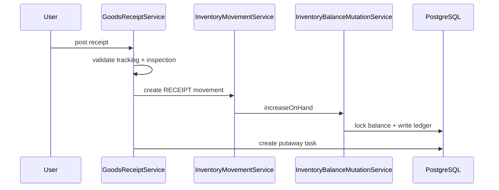

# Goods Receipt

Goods receipt Sprint 3B mengizinkan inbound stock dari sumber manual, placeholder purchase order, transfer receipt, customer return placeholder, opening correction, dan source lain yang tervalidasi.

## Key Rules

- posting receipt membuat `InventoryMovement` bertipe `RECEIPT`,
- lot, serial, manufacture date, dan expiration harus lengkap sebelum posting untuk product terkait,
- hasil inspeksi menentukan apakah stock masuk `AVAILABLE`, `QUARANTINE`, atau `DAMAGED`,
- posting receipt juga dapat membuat `PutawayTask`.

