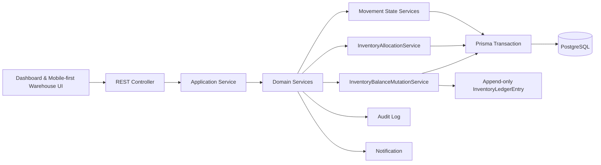
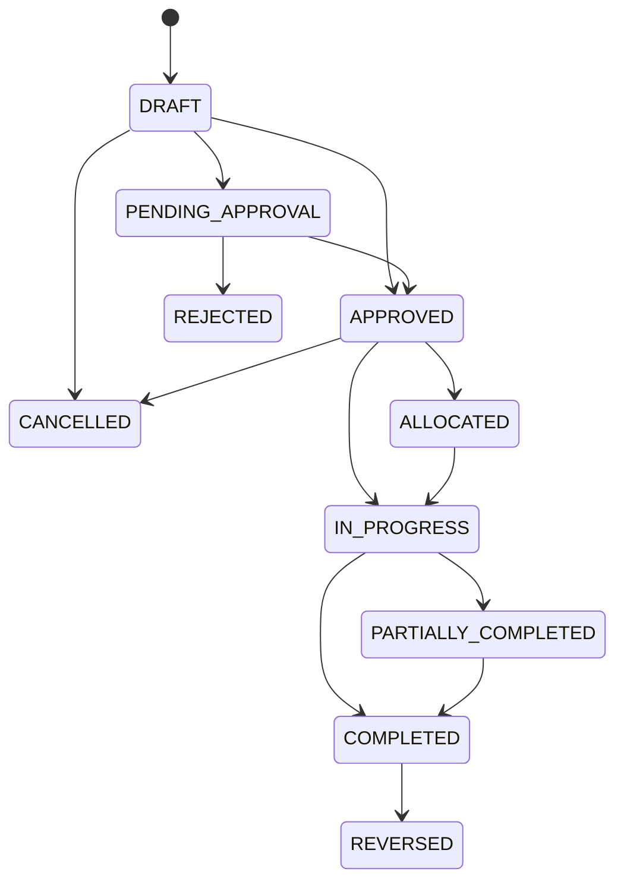
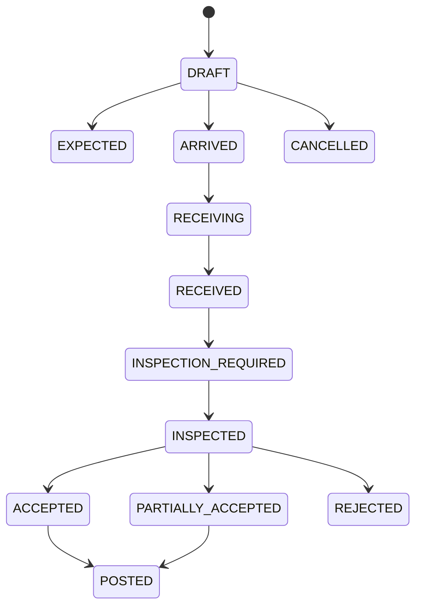
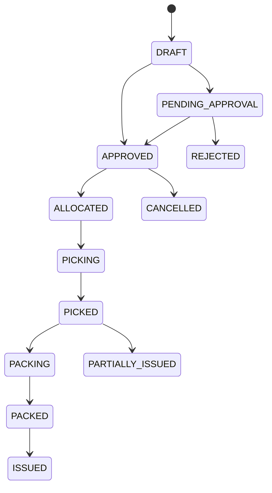
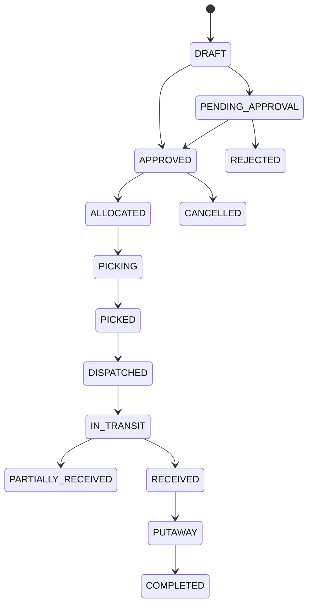
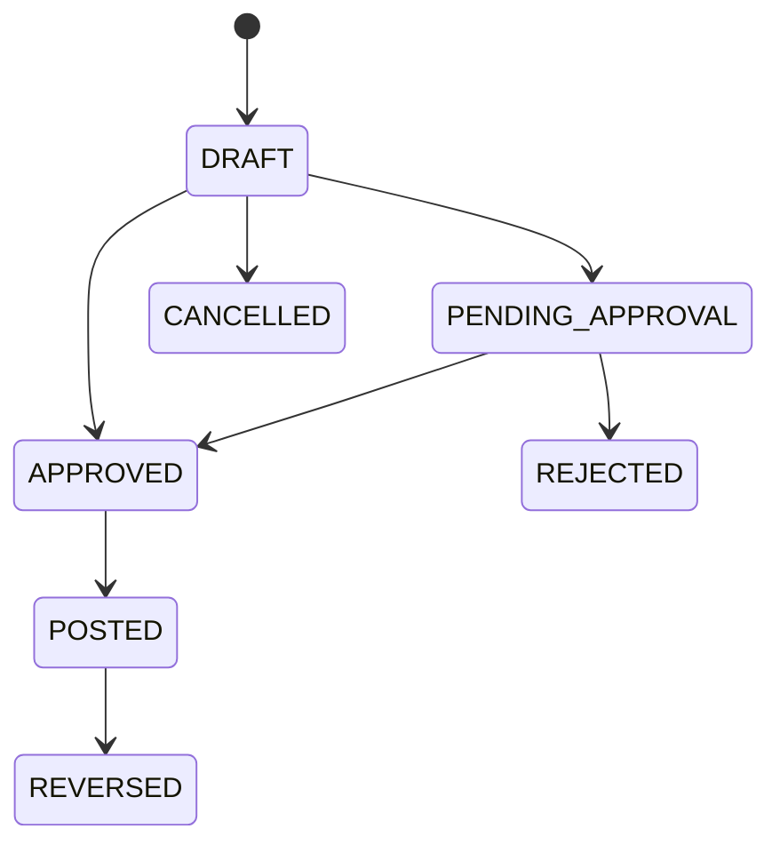
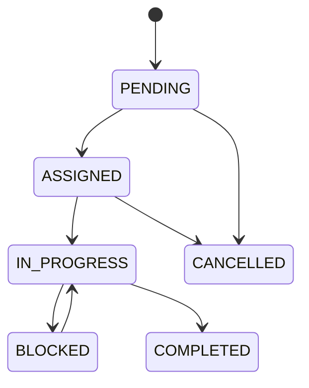

# Inventory Movement Engine

Sprint 3B menambahkan fondasi operasional warehouse dan stock movement di atas Sprint 1, Sprint 2, dan Sprint 3A tanpa membangun ulang domain yang sudah stabil.

## Audit Sprint 1-3A

### Sprint 1 reuse

- modular monolith `NestJS` + `Next.js App Router`,
- shared-schema multi-tenancy,
- auth, refresh token rotation, RBAC, audit log, notification, logging, dan testing foundation,
- `DocumentSequence`, response envelope, dan `AppException`.

### Sprint 2 reuse

- booking, customer, location, dan workflow operasional yang dapat menjadi sumber goods issue atau reservation,
- pricing, invoice, dan payment tetap terpisah dari mutation stok,
- pola domain service teruji untuk state transition dan deterministic calculation.

### Sprint 3A reuse

- `InventoryAvailabilityService`,
- `UnitConversionService`,
- `StorageLocationTreeService`,
- `InventoryBalance`, `InventoryLedgerEntry`, `InventoryLot`, `InventorySerial`, `InventoryReservation`,
- hierarchy `Warehouse -> WarehouseZone -> StorageLocation`,
- product variant sebagai stock unit,
- opening balance, reorder rule, dan alert foundation.

## Existing Service Reuse

- `InventoryAvailabilityService` untuk invariant quantity dan guard reservable stock.
- `UnitConversionService` untuk konversi `quantity -> stockingQuantity`.
- `StorageLocationTreeService` untuk path, depth, dan anti-circular validation.
- `BookingStatusTransitionService` dan `PricingCalculatorService` sebagai pola domain service deterministik yang bisa diikuti Sprint 3B.

## Regression Risks

- mutation balance langsung dari flow baru dapat merusak invariant Sprint 3A,
- perubahan enum `DocumentType` dan `InventoryLedgerEntryType` dapat memengaruhi seed dan migration,
- route baru yang terlalu agresif dapat mengacaukan shell dashboard,
- perubahan seed role/permission dapat memengaruhi akun demo lama,
- relation baru yang berlebihan dapat menimbulkan constraint conflict saat generate migration.

## Domain Terminology

- `InventoryMovement`: dokumen generik untuk seluruh mutasi stok.
- `InventoryMovementLine`: line item yang menyimpan quantity bisnis dan stocking quantity.
- `InventoryMovementAllocation`: breakdown lokasi, lot, serial, dan balance yang dipakai movement.
- `InventoryAllocation`: lapisan operasional di atas `InventoryReservation`.
- `Transit stock`: stok sementara antara source dan destination warehouse.
- `Putaway`: perpindahan dari receiving atau transit ke storage location final.
- `Picking`: pengambilan stok dari lokasi sumber ke staging atau dispatch flow.
- `Reversal`: transaksi korektif baru, bukan edit transaksi lama.

## High-Level Architecture

## Movement State Machine

## Goods Receipt State Machine

## Goods Issue State Machine

## Stock Transfer State Machine

## Adjustment State Machine

## Warehouse Task State Machine

## Domain Entity Map

- `InventoryMovement` menjadi parent untuk `InventoryMovementLine`, `InventoryMovementAllocation`, dan `InventoryMovementStatusHistory`.
- `GoodsReceipt`, `GoodsIssue`, `StockTransfer`, `StockAdjustment`, dan `InventoryStatusTransfer` adalah dokumen operasional yang memicu movement.
- `PutawayTask`, `PickingTask`, `PackingSession`, `DispatchRecord`, `WarehouseTask`, dan `StockCountSession` adalah eksekusi warehouse di atas movement.
- `InventoryAllocation` menyimpan keputusan lokasi-spesifik di atas `InventoryReservation`.
- `InventoryLedgerEntry` tetap append-only dan menjadi jejak final tiap mutasi.

## Prisma Additions

### New Models

- `InventoryMovement`
- `InventoryMovementLine`
- `InventoryMovementAllocation`
- `InventoryMovementStatusHistory`
- `GoodsReceipt`
- `GoodsReceiptItem`
- `GoodsReceiptInspection`
- `GoodsIssue`
- `GoodsIssueItem`
- `StockTransfer`
- `StockTransferItem`
- `StockTransferShipment`
- `StockTransferReceipt`
- `StockAdjustment`
- `StockAdjustmentItem`
- `InventoryStatusTransfer`
- `PutawayTask`
- `PutawayTaskItem`
- `PickingWave`
- `PickingTask`
- `PickingTaskItem`
- `PackingSession`
- `PackingItem`
- `DispatchRecord`
- `InventoryAllocation`
- `WarehouseTask`
- `WarehouseTaskAssignment`
- `InventoryMovementReversal`
- `StockCountSession`
- `StockCountLine`
- `ScanSession`
- `ScanEvent`

### New Enums

- `InventoryMovementType`
- `InventoryMovementStatus`
- `InventoryMovementSourceType`
- `MovementPriority`
- `InventoryAllocationStrategy`
- `InventoryMovementAllocationStatus`
- `GoodsReceiptStatus`
- `GoodsReceiptInspectionStatus`
- `GoodsIssueStatus`
- `StockTransferType`
- `StockTransferStatus`
- `StockTransferShipmentStatus`
- `StockTransferReceiptStatus`
- `StockAdjustmentType`
- `StockAdjustmentStatus`
- `InventoryStatusTransferStatus`
- `PutawayTaskStatus`
- `PickingWaveStrategy`
- `PickingWaveStatus`
- `PickingTaskStatus`
- `PackingSessionStatus`
- `DispatchRecordStatus`
- `InventoryAllocationStatus`
- `WarehouseTaskType`
- `WarehouseTaskStatus`
- `InventoryMovementReversalStatus`
- `StockCountType`
- `StockCountStatus`
- `StockCountScopeType`
- `ScanSessionStatus`
- `ScanType`

## Constraints

- document number unik per organization,
- idempotency key unik per organization bila terisi,
- line number unik per parent document,
- movement completed/posting immutable,
- reversal satu kali per movement original,
- from dan to location atau warehouse tidak boleh identik untuk transfer,
- posting receipt wajib tracking lengkap untuk lot/serial product.

## Index Strategy

- `(organizationId, status)` untuk seluruh dokumen utama,
- `(organizationId, movementType, movementDate)` untuk movement report,
- `(warehouseId, status)` untuk task backlog,
- `(productVariantId, status)` untuk allocation dan count lines,
- `(sourceType, sourceId)` untuk traceability,
- `(occurredAt)` dan `(movementId)` untuk ledger timeline,
- `(organizationId, idempotencyKey)` untuk movement dan posting flow.

## Ledger Update Strategy

- semua mutasi stok menulis `InventoryLedgerEntry` dalam transaction yang sama,
- `InventoryMovement` dan `InventoryMovementLine` menjadi referensi utama ledger Sprint 3B,
- snapshot source/destination balance disimpan saat relevan,
- reversal menulis ledger baru bertipe `REVERSAL`, tidak mengedit entry lama.

## Inventory Balance Mutation Strategy

- semua mutation melewati `InventoryBalanceMutationService`,
- caller menyiapkan transaction dan lock ordering,
- service melakukan validate tenant, validate invariant, mutate Decimal snapshot, increment version, lalu create ledger entry,
- `InventoryBalance` tidak diubah langsung dari controller atau module lain.

## FIFO Strategy

- pilih balance paling lama berdasarkan `receivedAt`, lalu fallback ke ledger `occurredAt`,
- abaikan `EXPIRED`, `BLOCKED`, dan `QUARANTINE`,
- hasil allocation deterministik dengan sort key stabil.

## FEFO Strategy

- prioritas utama `expirationDate` terdekat yang belum expired,
- lot tanpa expiration masuk fallback FIFO,
- cocok untuk product lot-tracked yang juga `tracksExpiration`.

## Serial Allocation Strategy

- serial tracked item dialokasikan eksplisit,
- serial harus unik, aktif, belum moved, dan berada di tenant/warehouse yang benar,
- scan mismatch menghasilkan hard error, bukan warning lunak.

## Transfer Transit Strategy

- dispatch mengurangi source balance dan memindahkan stok ke transit warehouse atau transit location,
- receipt destination menambah balance baru tanpa menghapus jejak transit,
- discrepancy antara shipped dan received dicatat sebagai transfer receipt variance.

## Reversal Strategy

- reversal memvalidasi bahwa stok masih dapat dikembalikan,
- membuat dokumen `InventoryMovementReversal` dan movement baru dengan delta berlawanan,
- serial, lot, dan allocation di-trace ke movement original.

## Stock Count Strategy

- count session membuat snapshot system quantity,
- submit count menghasilkan variance,
- approve dan post membuat `StockAdjustment`,
- freeze opsional memblokir atau me-warning transaction di scope yang sama.

## Concurrency Strategy

- PostgreSQL transaction,
- deterministic lock ordering: organization, warehouse, location, variant, lot, serial,
- row lock untuk source balance,
- optimistic version check saat write,
- retry terbatas pada conflict serializable,
- idempotency key pada posting flows.

## Idempotency Strategy

- create/post/dispatch/receive/reverse action menerima `idempotencyKey`,
- key disimpan per organization,
- replay mengembalikan dokumen atau result yang sama,
- duplicate conflicting payload menghasilkan `MOVEMENT_IDEMPOTENCY_CONFLICT`.

## Permission Map

- movement: create, approve, post, reverse, export.
- receipt: receive, inspect, post, cancel.
- issue: allocate, pick, pack, dispatch, post.
- transfer: allocate, ship, receive, complete.
- adjustment: submit, approve, post, reverse.
- allocation: create, release, override, strategy.
- putaway/picking/packing/dispatch/task/count/scan/report sesuai brief Sprint 3B.

## Default Role Update

- `OWNER`: semua permission organisasi.
- `ADMIN`: seluruh operasional warehouse, approval, posting, reversal.
- `MANAGER`: create, approve, allocate, report; posting mengikuti kebijakan.
- `WAREHOUSE_SUPERVISOR`: operasional warehouse tanpa RBAC/system setting.
- `WAREHOUSE_OPERATOR`: receive, putaway, picking, packing, dispatch, scan, count.
- `STAFF`: read inventory dan create request terbatas.
- `VIEWER`: read-only tanpa cost.

## REST Endpoint Map

- movement: `/inventory-movements`
- receipt: `/goods-receipts`
- issue: `/goods-issues`
- transfer: `/stock-transfers`
- adjustment: `/stock-adjustments`
- status transfer: `/inventory-status-transfers`
- allocation: `/inventory-allocations`
- putaway: `/putaway-tasks`
- picking: `/picking-waves`, `/picking-tasks`
- packing: `/packing-sessions`
- dispatch: `/dispatch-records`
- warehouse task: `/warehouse-tasks`
- count: `/stock-counts`
- scan: `/scan-sessions`, `/scan/resolve/:code`

## Frontend Route Map

- `/app/warehouse-operations/dashboard`
- `/app/warehouse-operations/movements`
- `/app/warehouse-operations/receipts`
- `/app/warehouse-operations/issues`
- `/app/warehouse-operations/transfers`
- `/app/warehouse-operations/adjustments`
- `/app/warehouse-operations/putaway`
- `/app/warehouse-operations/picking`
- `/app/warehouse-operations/packing`
- `/app/warehouse-operations/dispatch`
- `/app/warehouse-operations/tasks`
- `/app/warehouse-operations/stock-counts`
- `/app/warehouse-operations/scan`
- `/app/warehouse-operations/reports`
- `/app/inventory/allocations`
- `/app/inventory/status-transfers`

## Reusable Component Map

- badges: status, type, strategy, transit,
- timeline and ledger tables,
- allocation preview and breakdown,
- goods receipt, adjustment, stock count, and movement line tables,
- tracking inputs for serial and lot,
- mobile-first scan widgets for putaway and picking,
- dialogs for posting, reversal, short pick, dispatch, and receive.

## Query Key Map

- `inventoryMovementKeys`
- `goodsReceiptKeys`
- `goodsIssueKeys`
- `stockTransferKeys`
- `stockAdjustmentKeys`
- `inventoryAllocationKeys`
- `putawayKeys`
- `pickingKeys`
- `packingKeys`
- `dispatchKeys`
- `warehouseTaskKeys`
- `stockCountKeys`
- `movementAnalyticsKeys`

## Error Code Map

- movement state, reversal, and idempotency conflict,
- receipt validation, inspection, and serial mismatch,
- issue allocation and posting,
- transfer same-location, discrepancy, and transit receipt,
- adjustment reason and approval threshold,
- allocation partial and fulfillment,
- putaway capacity and location mismatch,
- picking lot, serial, and short pick,
- stock count freeze, variance, and posting,
- scan resolve and entity mismatch.

## Seed Plan

- tambah sequence movement documents,
- tambah sample receipt, issue, transfer, adjustment, allocation, task, count, scan, dan reversal,
- gunakan lot, serial, quarantine, damaged, dan transit stock agar dashboard Sprint 3B hidup.

## Test Plan

- state transition tests,
- FIFO/FEFO/serial allocation tests,
- mutation invariant tests,
- putaway suggestion tests,
- reversal and transit tests,
- root validation `lint`, `typecheck`, `test`, `build`.

## File-by-File Implementation Order

1. `packages/shared-types/src/index.ts`
2. `apps/api/src/common/constants/error-codes.ts`
3. `prisma/schema.prisma`
4. `prisma/migrations/*`
5. `prisma/seed.ts`
6. `apps/api/src/modules/inventory-movements/*`
7. `apps/api/src/modules/inventory-allocations/*`
8. `apps/api/src/modules/goods-receipts/*`
9. `apps/api/src/modules/goods-issues/*`
10. `apps/api/src/modules/stock-transfers/*`
11. `apps/api/src/modules/stock-adjustments/*`
12. `apps/api/src/modules/putaway/*`
13. `apps/api/src/modules/picking/*`
14. `apps/api/src/modules/warehouse-tasks/*`
15. `apps/web/src/services/api/*`
16. `apps/web/src/app/(dashboard)/app/warehouse-operations/**`
17. `README.md` dan dokumen Sprint 3B lain.

## Acceptance Criteria Per Phase

### Phase 1

- audit sprint sebelumnya terdokumentasi,
- terminology, architecture, state machine, strategi, dan risk map tersedia,
- endpoint, route, component, query key, error map, seed plan, dan test plan terdokumentasi.

### Phase 2

- model, enum, constraint, dan index Sprint 3B terdokumentasi,
- ledger, balance mutation, allocation, reversal, transit, count, concurrency, dan idempotency strategy jelas,
- implementation order dan acceptance criteria siap menjadi panduan coding.
