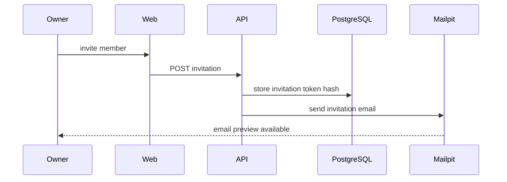

# Multi-Tenancy

NovaERP Sprint 1 menggunakan shared database dan shared schema.

## Rules

- Satu user dapat bergabung ke banyak organization.
- Membership menjadi sumber kebenaran organization context.
- `organizationId` dari client tidak boleh langsung dipercaya.
- Semua query tenant harus memfilter berdasarkan tenant context tervalidasi.

## Invitation Sequence

## Boundaries

- `Organization`
- `Workspace`
- `Membership`
- `Role`
- `Invitation`
- `AuditLog`
- `OrganizationSetting`
