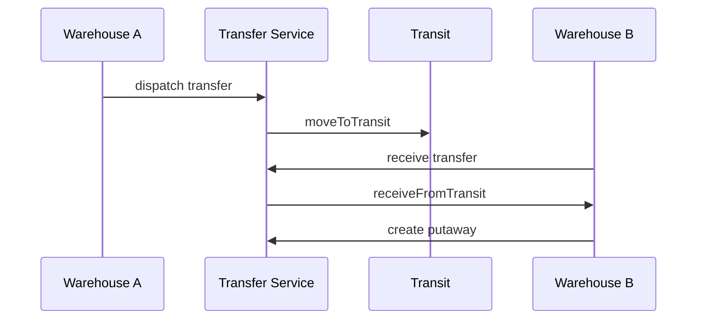

# Stock Transfer

Stock transfer Sprint 3B mendukung internal location transfer dan inter-warehouse transfer dengan transit stock.

## Rules

- internal transfer selesai dalam satu transaction namun tetap membuat source/destination ledger,
- inter-warehouse transfer memindahkan stok ke transit pada dispatch dan ke destination saat receipt,
- discrepancy antara shipped dan received dicatat eksplisit,
- lot identity dipertahankan dan serial harus konsisten.

