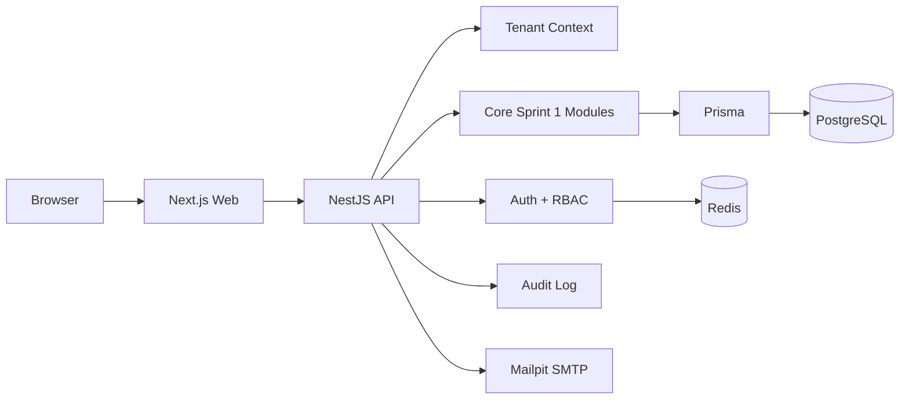

# System Overview

NovaERP Sprint 1 memakai arsitektur modular monolith dalam monorepo untuk menjaga kecepatan delivery tanpa mengorbankan isolasi modul. Fokus utama adalah auth, multi-tenancy, RBAC, organization management, workspace management, audit log, dan dashboard dasar.

## Runtime Topology

## Module Map

- Auth
- Users and Profiles
- Organizations
- Workspaces
- Memberships
- Roles and Permissions
- Invitations
- Audit Logs
- Settings
- Notifications
- Health

## Request Flow

1. Client memanggil endpoint `/api/v1`.
2. Backend melakukan parsing environment, logger binding, dan request correlation.
3. Auth guard memvalidasi access token.
4. Tenant guard menentukan membership aktif dan organization context.
5. Permission guard mengecek permission dari cache atau database.
6. Service menjalankan business rules.
7. Repository memanggil Prisma dengan tenant filter yang sesuai.
8. Response dikembalikan melalui envelope konsisten.
