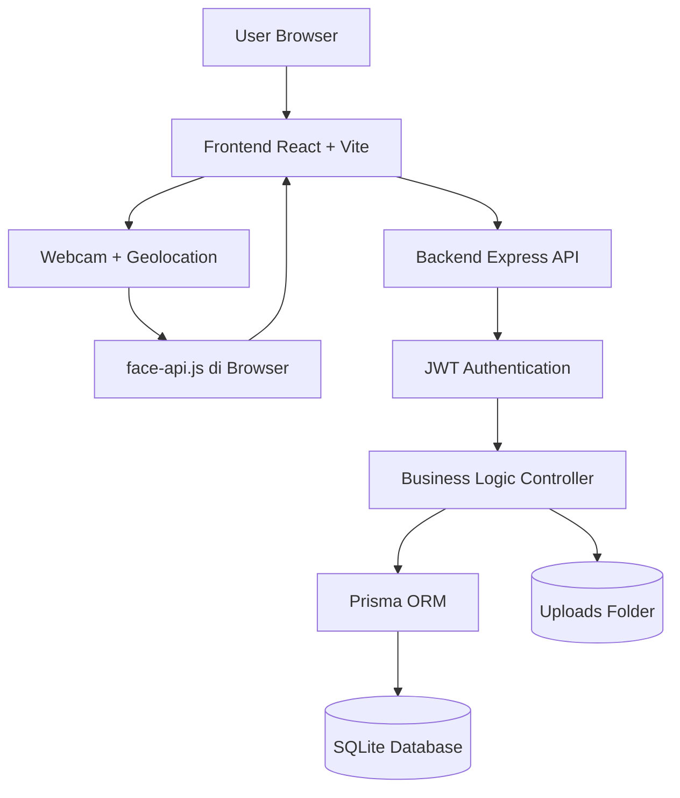

# Arsitektur Sistem Komdigi HRIS

## Gambaran Umum

Komdigi HRIS menggunakan arsitektur web client-server dengan frontend React, backend Express, Prisma ORM, dan database SQLite. Browser juga menangani proses face recognition menggunakan `face-api.js`.

## Diagram Arsitektur

## Komponen Utama

### Frontend

Frontend dibangun menggunakan React dan Vite. Tanggung jawab utamanya:

- menampilkan UI dashboard
- menangani routing aplikasi
- memanggil API backend
- mengakses webcam dan geolokasi
- menjalankan face detection dan face descriptor extraction

### Backend

Backend dibangun dengan Node.js dan Express. Tanggung jawab utamanya:

- autentikasi login
- verifikasi token JWT
- validasi role dan scope akses
- CRUD pegawai
- pengelolaan absensi
- pengelolaan notifikasi dan activity log
- pengelolaan organisasi dan proyek

### Database

Database saat ini menggunakan SQLite dengan Prisma ORM. Database menyimpan:

- user
- role
- direktorat
- divisi
- attendance
- notification
- activity log
- project
- project member

### Upload Storage

Folder `uploads` dipakai untuk menyimpan:

- foto profil user
- foto hasil capture absensi

## Alur Data Singkat

1. User login dari frontend.
2. Backend memverifikasi email dan password.
3. Backend mengirim token JWT.
4. Frontend menyimpan token dan menggunakannya untuk request berikutnya.
5. Saat absensi, frontend mengaktifkan webcam dan menjalankan `face-api.js`.
6. Descriptor wajah dibandingkan di sisi browser.
7. Hasil validasi dan foto capture dikirim ke backend.
8. Backend menyimpan data absensi, notifikasi, dan activity log.
