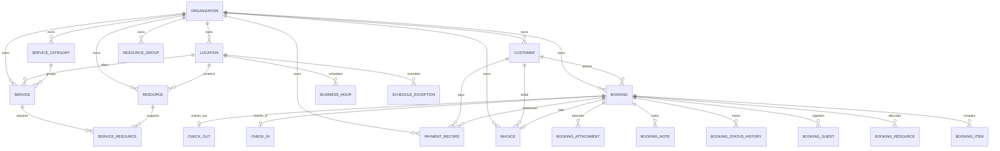

# Booking ERD

```mermaid
erDiagram
  ORGANIZATION ||--o{ CUSTOMER : owns
  ORGANIZATION ||--o{ LOCATION : owns
  ORGANIZATION ||--o{ SERVICE_CATEGORY : owns
  ORGANIZATION ||--o{ SERVICE : owns
  ORGANIZATION ||--o{ RESOURCE_GROUP : owns
  ORGANIZATION ||--o{ RESOURCE : owns
  ORGANIZATION ||--o{ BOOKING : owns
  ORGANIZATION ||--o{ INVOICE : owns
  ORGANIZATION ||--o{ PAYMENT_RECORD : owns

  CUSTOMER ||--o{ BOOKING : places
  CUSTOMER ||--o{ INVOICE : billed
  CUSTOMER ||--o{ PAYMENT_RECORD : pays

  LOCATION ||--o{ RESOURCE : contains
  LOCATION ||--o{ SERVICE : offers
  LOCATION ||--o{ BUSINESS_HOUR : schedules
  LOCATION ||--o{ SCHEDULE_EXCEPTION : overrides

  SERVICE_CATEGORY ||--o{ SERVICE : groups
  SERVICE ||--o{ SERVICE_RESOURCE : requires
  RESOURCE ||--o{ SERVICE_RESOURCE : supports

  BOOKING ||--o{ BOOKING_ITEM : includes
  BOOKING ||--o{ BOOKING_RESOURCE : allocates
  BOOKING ||--o{ BOOKING_GUEST : registers
  BOOKING ||--o{ BOOKING_STATUS_HISTORY : tracks
  BOOKING ||--o{ BOOKING_NOTE : notes
  BOOKING ||--o{ BOOKING_ATTACHMENT : attaches
  BOOKING ||--o| INVOICE : bills
  BOOKING ||--o{ PAYMENT_RECORD : references
  BOOKING ||--o| CHECK_IN : checks_in
  BOOKING ||--o| CHECK_OUT : checks_out
```
