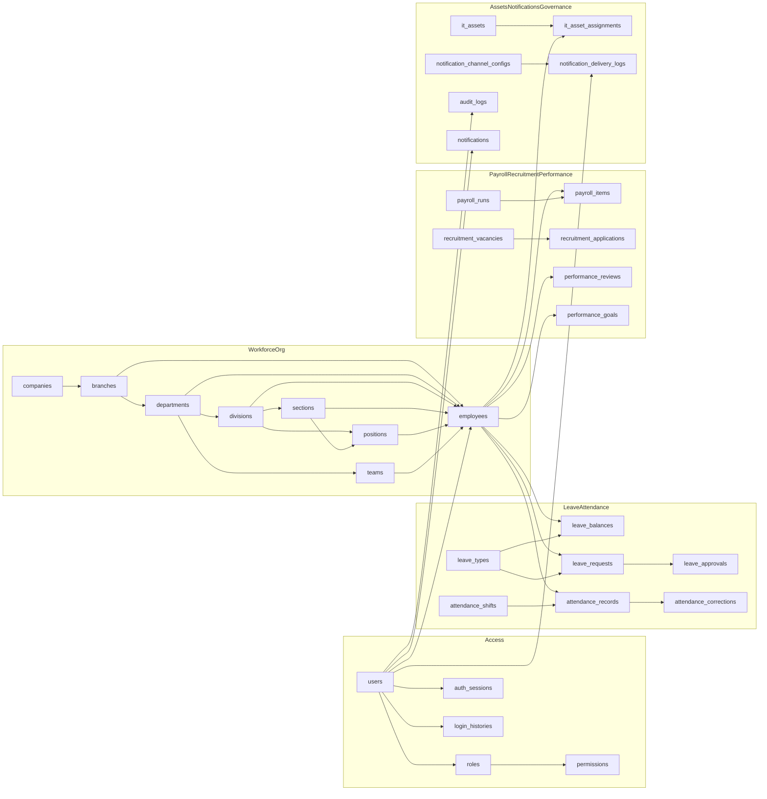

# Domain Data Diagram

Diagram ini menunjukkan hubungan data antar domain utama pada level business capability.

```mermaid
flowchart LR
    subgraph Access
        U[users]
        R[roles]
        P[permissions]
        S[auth_sessions]
        L[login_histories]
    end

    subgraph WorkforceOrg
        C[companies]
        B[branches]
        D[departments]
        DV[divisions]
        SC[sections]
        PO[positions]
        T[teams]
        E[employees]
    end

    subgraph LeaveAttendance
        LT[leave_types]
        LB[leave_balances]
        LR[leave_requests]
        LA[leave_approvals]
        AS[attendance_shifts]
        AR[attendance_records]
        AC[attendance_corrections]
    end

    subgraph PayrollRecruitmentPerformance
        PR[payroll_runs]
        PI[payroll_items]
        RV[recruitment_vacancies]
        RA[recruitment_applications]
        PF[performance_reviews]
        PG[performance_goals]
    end

    subgraph AssetsNotificationsGovernance
        IA[it_assets]
        IAA[it_asset_assignments]
        NC[notification_channel_configs]
        ND[notification_delivery_logs]
        AL[audit_logs]
        N[notifications]
    end

    U --> R
    R --> P
    U --> S
    U --> L
    U --> E
    C --> B
    B --> D
    D --> DV
    DV --> SC
    DV --> PO
    SC --> PO
    D --> T
    B --> E
    D --> E
    DV --> E
    SC --> E
    PO --> E
    T --> E
    E --> LB
    LT --> LB
    E --> LR
    LT --> LR
    LR --> LA
    E --> AR
    AS --> AR
    AR --> AC
    E --> PI
    PR --> PI
    RV --> RA
    E --> PF
    E --> PG
    IA --> IAA
    E --> IAA
    U --> N
    NC --> ND
    U --> ND
    U --> AL
```
