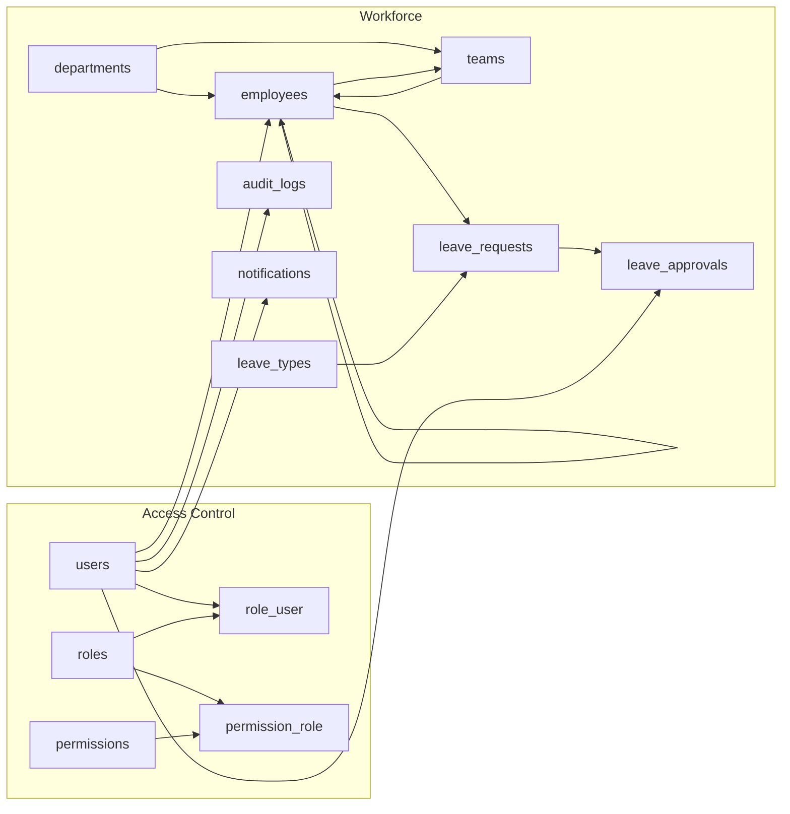

# Database Diagram

```mermaid
flowchart LR
    subgraph Access Control
      U[users]
      R[roles]
      P[permissions]
      RU[role_user]
      PR[permission_role]
    end

    subgraph Workforce
      D[departments]
      T[teams]
      E[employees]
      LT[leave_types]
      LR[leave_requests]
      LA[leave_approvals]
      A[audit_logs]
      N[notifications]
    end

    U --> RU
    R --> RU
    R --> PR
    P --> PR
    D --> E
    D --> T
    T --> E
    U --> E
    E --> E
    E --> T
    E --> LR
    LT --> LR
    LR --> LA
    U --> LA
    U --> N
    U --> A
```
