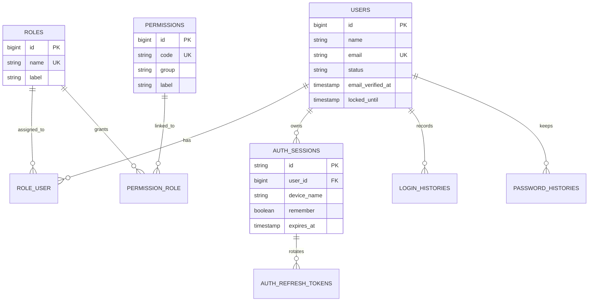
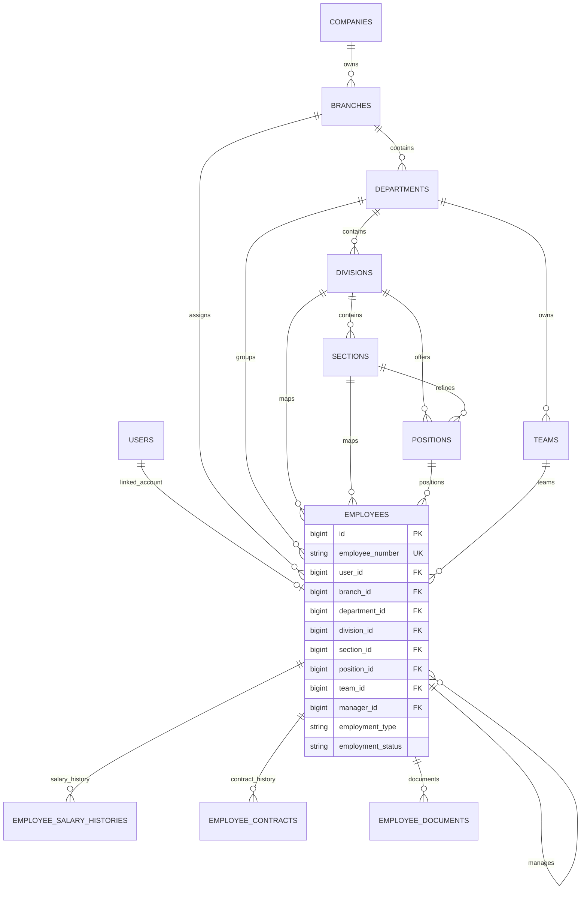
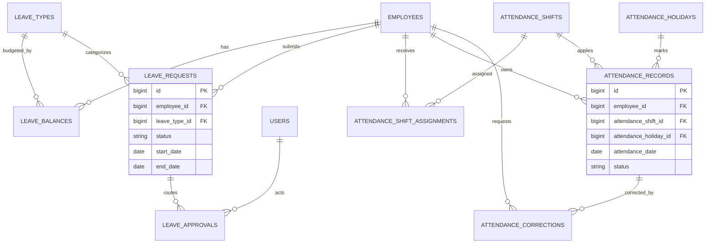
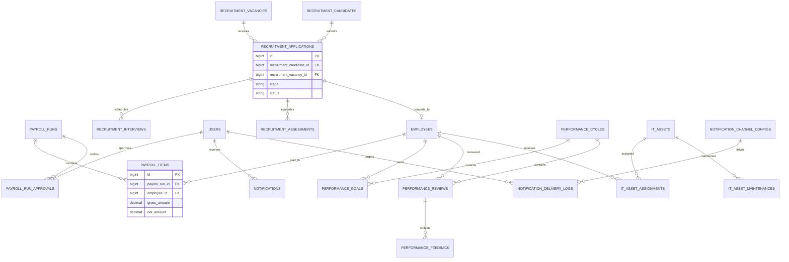
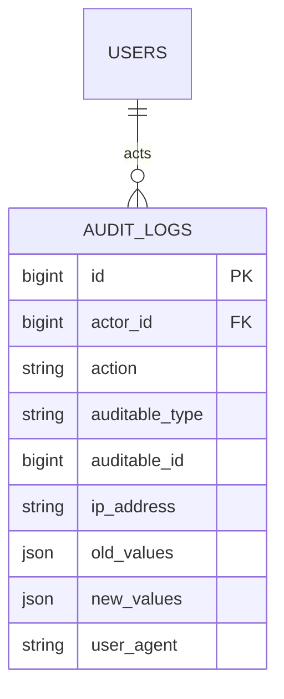

# ERD

The ERD below summarizes the core database relationships in Enterprise HRIS. The diagrams are split by domain to keep them readable.

## Identity and Access

## Workforce and Organization

## Leave and Attendance

## Payroll, Recruitment, Performance, Assets, Notifications

## Governance and Cross-Cutting Audit

## Notes

- `notifications` uses Laravel's built-in notifiable pattern, so its relationship is polymorphic.
- `audit_logs` is also polymorphic through the `auditable_type` and `auditable_id` pair.
- Framework tables such as `jobs`, `cache`, `failed_jobs`, and `sessions` are not shown in full above because they are not core HRIS domain tables, even though they still exist in the project schema.
