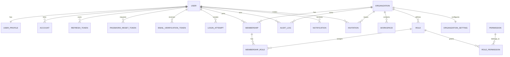

# NovaERP Sprint 1 ERD

```mermaid
erDiagram
  USER ||--|| USER_PROFILE : has
  USER ||--o{ ACCOUNT : links
  USER ||--o{ REFRESH_TOKEN : owns
  USER ||--o{ PASSWORD_RESET_TOKEN : requests
  USER ||--o{ EMAIL_VERIFICATION_TOKEN : receives
  USER ||--o{ LOGIN_ATTEMPT : creates
  USER ||--o{ MEMBERSHIP : joins
  USER ||--o{ AUDIT_LOG : acts
  USER ||--o{ NOTIFICATION : receives
  USER ||--o{ INVITATION : invites

  ORGANIZATION ||--o{ WORKSPACE : contains
  ORGANIZATION ||--o{ MEMBERSHIP : has
  ORGANIZATION ||--o{ ROLE : defines
  ORGANIZATION ||--o{ INVITATION : issues
  ORGANIZATION ||--|| ORGANIZATION_SETTING : configures
  ORGANIZATION ||--o{ AUDIT_LOG : owns

  MEMBERSHIP ||--o{ MEMBERSHIP_ROLE : has
  ROLE ||--o{ MEMBERSHIP_ROLE : assigns
  ROLE ||--o{ ROLE_PERMISSION : grants
  PERMISSION ||--o{ ROLE_PERMISSION : belongs_to
```
