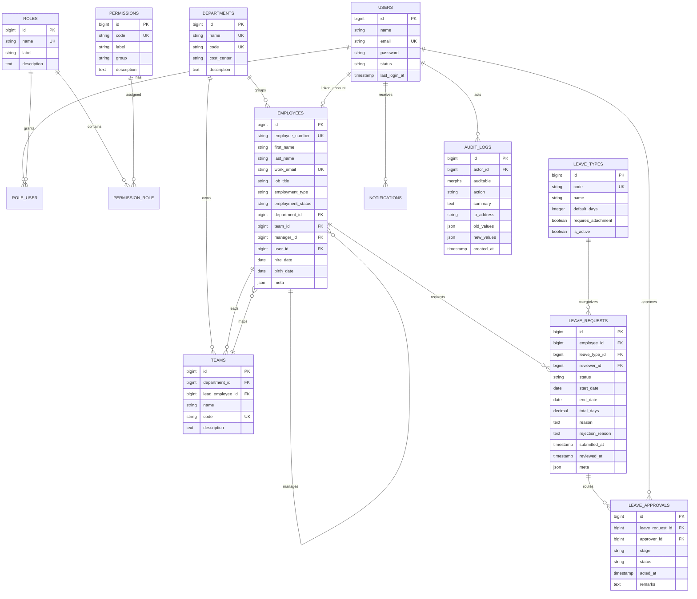

# ERD

```mermaid
erDiagram
    USERS ||--o{ ROLE_USER : has
    ROLES ||--o{ ROLE_USER : grants
    ROLES ||--o{ PERMISSION_ROLE : contains
    PERMISSIONS ||--o{ PERMISSION_ROLE : assigned
    DEPARTMENTS ||--o{ EMPLOYEES : groups
    DEPARTMENTS ||--o{ TEAMS : owns
    TEAMS ||--o{ EMPLOYEES : maps
    USERS ||--o| EMPLOYEES : linked_account
    EMPLOYEES ||--o{ EMPLOYEES : manages
    EMPLOYEES ||--o{ TEAMS : leads
    EMPLOYEES ||--o{ LEAVE_REQUESTS : requests
    LEAVE_TYPES ||--o{ LEAVE_REQUESTS : categorizes
    LEAVE_REQUESTS ||--o{ LEAVE_APPROVALS : routes
    USERS ||--o{ LEAVE_APPROVALS : approves
    USERS ||--o{ NOTIFICATIONS : receives
    USERS ||--o{ AUDIT_LOGS : acts

    USERS {
        bigint id PK
        string name
        string email UK
        string password
        string status
        timestamp last_login_at
    }

    ROLES {
        bigint id PK
        string name UK
        string label
        text description
    }

    PERMISSIONS {
        bigint id PK
        string code UK
        string label
        string group
        text description
    }

    DEPARTMENTS {
        bigint id PK
        string name UK
        string code UK
        string cost_center
        text description
    }

    TEAMS {
        bigint id PK
        bigint department_id FK
        bigint lead_employee_id FK
        string name
        string code UK
        text description
    }

    EMPLOYEES {
        bigint id PK
        string employee_number UK
        string first_name
        string last_name
        string work_email UK
        string job_title
        string employment_type
        string employment_status
        bigint department_id FK
        bigint team_id FK
        bigint manager_id FK
        bigint user_id FK
        date hire_date
        date birth_date
        json meta
    }

    LEAVE_TYPES {
        bigint id PK
        string code UK
        string name
        integer default_days
        boolean requires_attachment
        boolean is_active
    }

    LEAVE_REQUESTS {
        bigint id PK
        bigint employee_id FK
        bigint leave_type_id FK
        bigint reviewer_id FK
        string status
        date start_date
        date end_date
        decimal total_days
        text reason
        text rejection_reason
        timestamp submitted_at
        timestamp reviewed_at
        json meta
    }

    LEAVE_APPROVALS {
        bigint id PK
        bigint leave_request_id FK
        bigint approver_id FK
        string stage
        string status
        timestamp acted_at
        text remarks
    }

    AUDIT_LOGS {
        bigint id PK
        bigint actor_id FK
        morphs auditable
        string action
        text summary
        string ip_address
        json old_values
        json new_values
        timestamp created_at
    }
```
