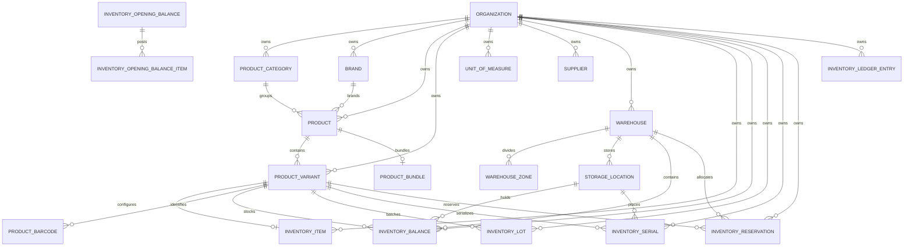

# Inventory ERD

```mermaid
erDiagram
  ORGANIZATION ||--o{ PRODUCT_CATEGORY : owns
  ORGANIZATION ||--o{ BRAND : owns
  ORGANIZATION ||--o{ PRODUCT : owns
  ORGANIZATION ||--o{ PRODUCT_VARIANT : owns
  ORGANIZATION ||--o{ UNIT_OF_MEASURE : owns
  ORGANIZATION ||--o{ SUPPLIER : owns
  ORGANIZATION ||--o{ WAREHOUSE : owns
  ORGANIZATION ||--o{ INVENTORY_ITEM : owns
  ORGANIZATION ||--o{ INVENTORY_BALANCE : owns
  ORGANIZATION ||--o{ INVENTORY_LOT : owns
  ORGANIZATION ||--o{ INVENTORY_SERIAL : owns
  ORGANIZATION ||--o{ INVENTORY_RESERVATION : owns
  ORGANIZATION ||--o{ INVENTORY_LEDGER_ENTRY : owns

  PRODUCT_CATEGORY ||--o{ PRODUCT : groups
  BRAND ||--o{ PRODUCT : brands
  PRODUCT ||--o{ PRODUCT_VARIANT : contains
  PRODUCT ||--o| PRODUCT_BUNDLE : bundles
  PRODUCT_VARIANT ||--o| INVENTORY_ITEM : configures
  PRODUCT_VARIANT ||--o{ PRODUCT_BARCODE : identifies
  PRODUCT_VARIANT ||--o{ INVENTORY_BALANCE : stocks
  PRODUCT_VARIANT ||--o{ INVENTORY_LOT : batches
  PRODUCT_VARIANT ||--o{ INVENTORY_SERIAL : serializes
  PRODUCT_VARIANT ||--o{ INVENTORY_RESERVATION : reserves

  WAREHOUSE ||--o{ WAREHOUSE_ZONE : divides
  WAREHOUSE ||--o{ STORAGE_LOCATION : stores
  WAREHOUSE ||--o{ INVENTORY_BALANCE : contains
  WAREHOUSE ||--o{ INVENTORY_RESERVATION : allocates

  STORAGE_LOCATION ||--o{ INVENTORY_BALANCE : holds
  STORAGE_LOCATION ||--o{ INVENTORY_SERIAL : places
  INVENTORY_OPENING_BALANCE ||--o{ INVENTORY_OPENING_BALANCE_ITEM : posts
```
