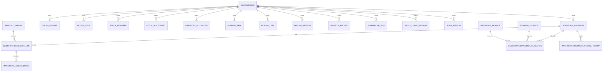

# Sprint 3B ERD

```mermaid
erDiagram
  ORGANIZATION ||--o{ INVENTORY_MOVEMENT : owns
  INVENTORY_MOVEMENT ||--o{ INVENTORY_MOVEMENT_LINE : has
  INVENTORY_MOVEMENT ||--o{ INVENTORY_MOVEMENT_ALLOCATION : allocates
  INVENTORY_MOVEMENT ||--o{ INVENTORY_MOVEMENT_STATUS_HISTORY : tracks
  ORGANIZATION ||--o{ GOODS_RECEIPT : owns
  ORGANIZATION ||--o{ GOODS_ISSUE : owns
  ORGANIZATION ||--o{ STOCK_TRANSFER : owns
  ORGANIZATION ||--o{ STOCK_ADJUSTMENT : owns
  ORGANIZATION ||--o{ INVENTORY_ALLOCATION : owns
  ORGANIZATION ||--o{ PUTAWAY_TASK : owns
  ORGANIZATION ||--o{ PICKING_TASK : owns
  ORGANIZATION ||--o{ PACKING_SESSION : owns
  ORGANIZATION ||--o{ DISPATCH_RECORD : owns
  ORGANIZATION ||--o{ WAREHOUSE_TASK : owns
  ORGANIZATION ||--o{ STOCK_COUNT_SESSION : owns
  ORGANIZATION ||--o{ SCAN_SESSION : owns
  PRODUCT_VARIANT ||--o{ INVENTORY_MOVEMENT_LINE : moves
  STORAGE_LOCATION ||--o{ INVENTORY_MOVEMENT_ALLOCATION : sources
  INVENTORY_BALANCE ||--o{ INVENTORY_MOVEMENT_ALLOCATION : reserves
  INVENTORY_MOVEMENT_LINE ||--o{ INVENTORY_LEDGER_ENTRY : journals
```
