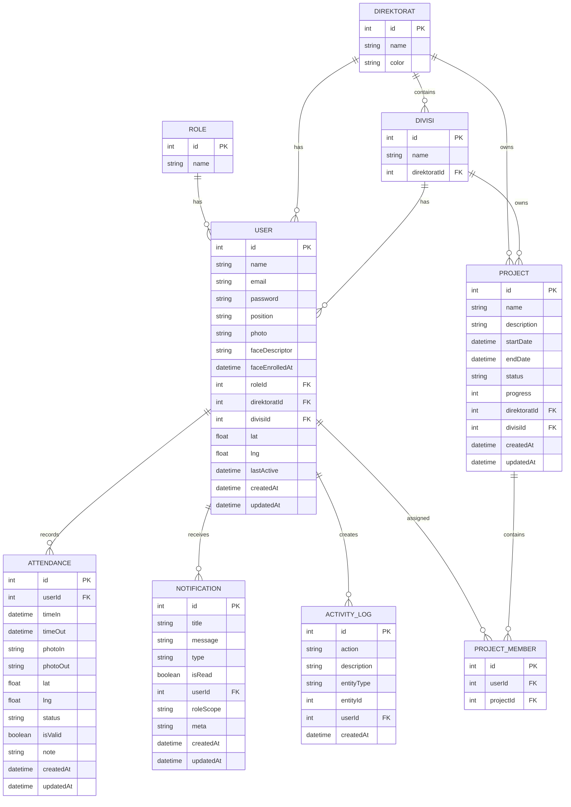

# ERD Database Komdigi HRIS

## Entity Relationship Diagram

## Penjelasan Relasi

- `Role` ke `User`: satu role dapat dimiliki banyak user.
- `Direktorat` ke `Divisi`: satu direktorat memiliki banyak divisi.
- `Direktorat` ke `User`: satu direktorat memiliki banyak user.
- `Divisi` ke `User`: satu divisi memiliki banyak user.
- `User` ke `Attendance`: satu user memiliki banyak data absensi.
- `User` ke `Notification`: user dapat menerima banyak notifikasi.
- `User` ke `ActivityLog`: aktivitas user dicatat dalam banyak log.
- `Project` ke `ProjectMember`: satu proyek memiliki banyak anggota.
- `User` ke `ProjectMember`: satu user dapat bergabung di banyak proyek.

## Catatan Desain

- `faceDescriptor` menyimpan data biometrik wajah untuk proses pencocokan saat absensi.
- `roleScope` pada notifikasi dipakai untuk broadcast notifikasi berdasarkan role.
- `meta` dipakai untuk data tambahan yang fleksibel, misalnya ID absensi bermasalah.
