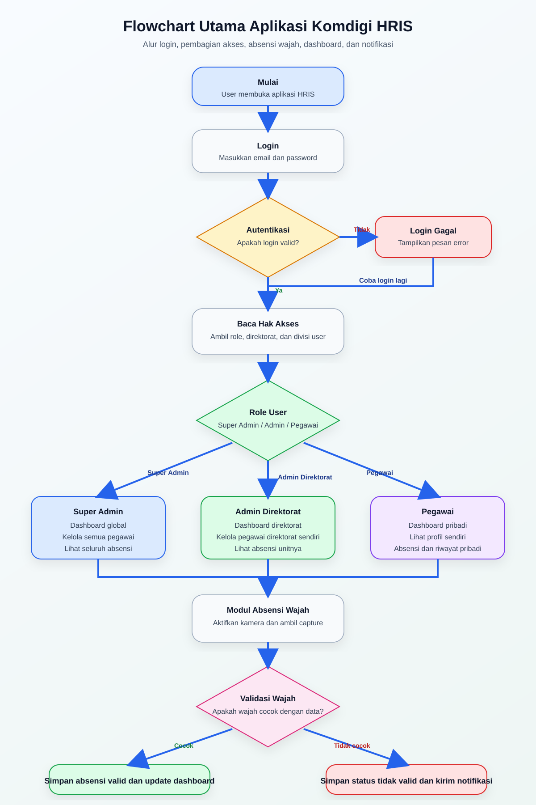
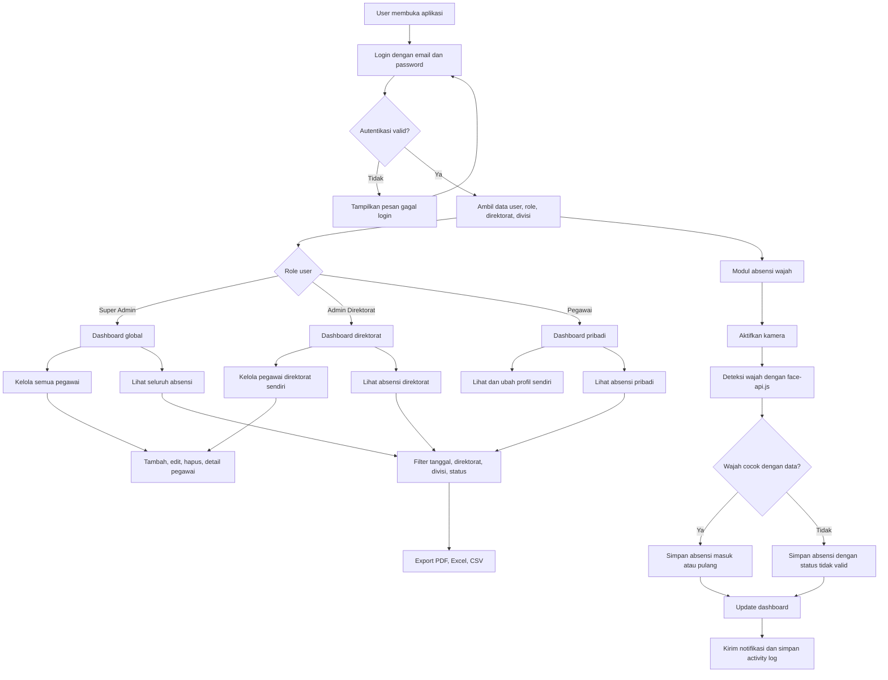
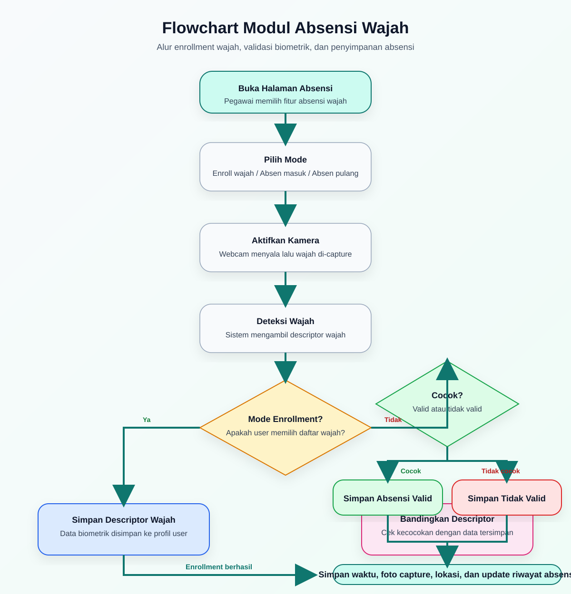
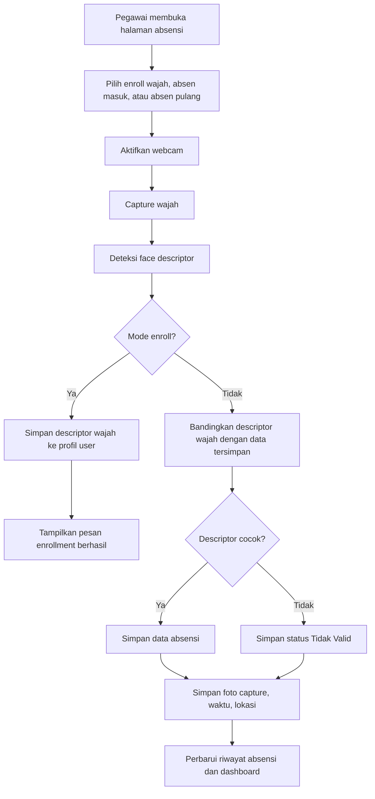

# Flowchart Aplikasi Komdigi HRIS

## Gambar Flowchart Utama

## Flowchart Utama

```mermaid
flowchart TD
    A[User membuka aplikasi] --> B[Login dengan email dan password]
    B --> C{Autentikasi valid?}

    C -- Tidak --> D[Tampilkan pesan gagal login]
    D --> B

    C -- Ya --> E[Ambil data user, role, direktorat, divisi]
    E --> F{Role user}

    F -- Super Admin --> G[Dashboard global]
    F -- Admin Direktorat --> H[Dashboard direktorat]
    F -- Pegawai --> I[Dashboard pribadi]

    G --> J[Kelola semua pegawai]
    H --> K[Kelola pegawai direktorat sendiri]
    I --> L[Lihat dan ubah profil sendiri]

    J --> M[Tambah, edit, hapus, detail pegawai]
    K --> M

    G --> N[Lihat seluruh absensi]
    H --> O[Lihat absensi direktorat]
    I --> P[Lihat absensi pribadi]

    N --> Q[Filter tanggal, direktorat, divisi, status]
    O --> Q
    P --> Q
    Q --> R[Export PDF, Excel, CSV]

    E --> S[Modul absensi wajah]
    S --> T[Aktifkan kamera]
    T --> U[Deteksi wajah dengan face-api.js]
    U --> V{Wajah cocok dengan data?}

    V -- Ya --> W[Simpan absensi masuk atau pulang]
    V -- Tidak --> X[Simpan absensi dengan status tidak valid]

    W --> Y[Update dashboard]
    X --> Y

    Y --> Z[Kirim notifikasi dan simpan activity log]
```

## Gambar Flowchart Absensi Wajah

## Flowchart Absensi Wajah

```mermaid
flowchart TD
    A[Pegawai membuka halaman absensi] --> B[Pilih enroll wajah, absen masuk, atau absen pulang]
    B --> C[Aktifkan webcam]
    C --> D[Capture wajah]
    D --> E[Deteksi face descriptor]
    E --> F{Mode enroll?}

    F -- Ya --> G[Simpan descriptor wajah ke profil user]
    G --> H[Tampilkan pesan enrollment berhasil]

    F -- Tidak --> I[Bandingkan descriptor wajah dengan data tersimpan]
    I --> J{Descriptor cocok?}

    J -- Ya --> K[Simpan data absensi]
    J -- Tidak --> L[Simpan status Tidak Valid]

    K --> M[Simpan foto capture, waktu, lokasi]
    L --> M
    M --> N[Perbarui riwayat absensi dan dashboard]
```
