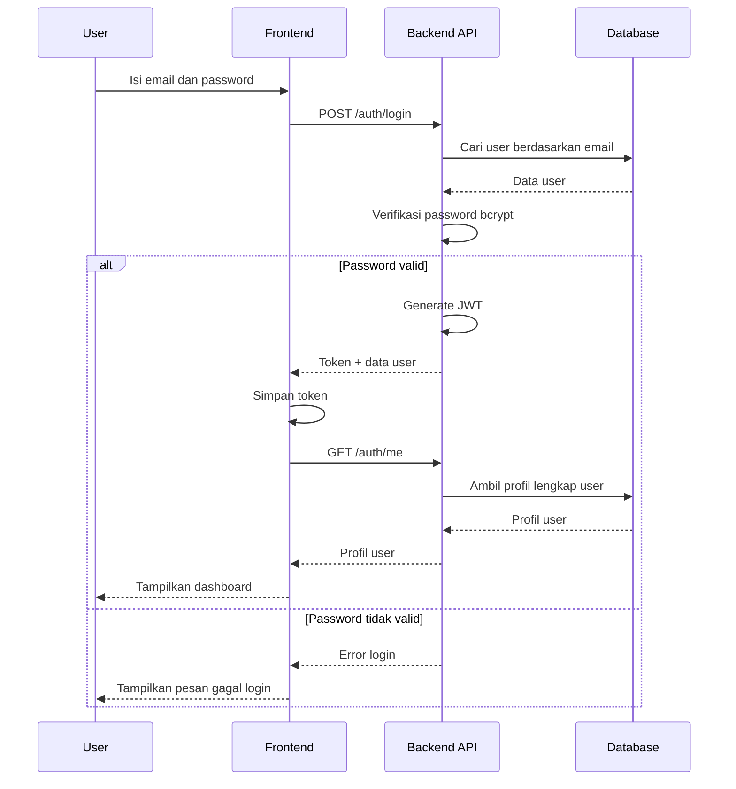
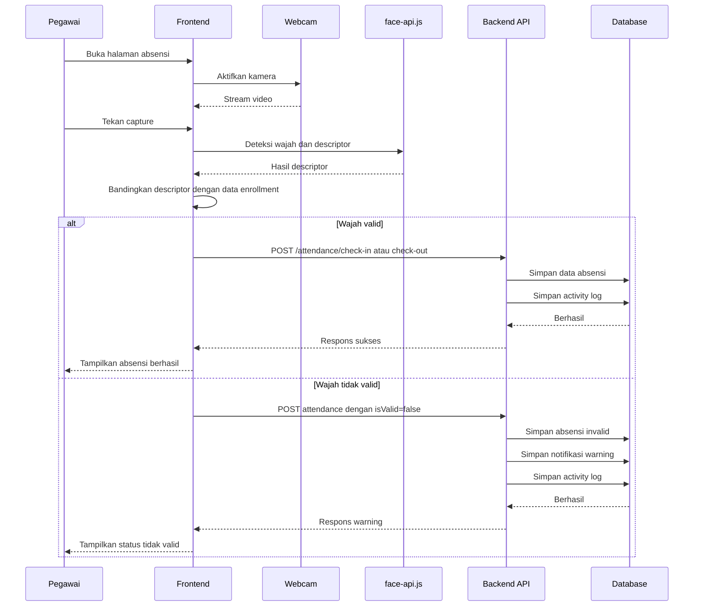

# Sequence Diagram Komdigi HRIS

## 1. Sequence Diagram Login

```mermaid
sequenceDiagram
    participant U as User
    participant FE as Frontend
    participant API as Backend API
    participant DB as Database

    U->>FE: Isi email dan password
    FE->>API: POST /auth/login
    API->>DB: Cari user berdasarkan email
    DB-->>API: Data user
    API->>API: Verifikasi password bcrypt

    alt Password valid
        API->>API: Generate JWT
        API-->>FE: Token + data user
        FE->>FE: Simpan token
        FE->>API: GET /auth/me
        API->>DB: Ambil profil lengkap user
        DB-->>API: Profil user
        API-->>FE: Profil user
        FE-->>U: Tampilkan dashboard
    else Password tidak valid
        API-->>FE: Error login
        FE-->>U: Tampilkan pesan gagal login
    end
```

## 2. Sequence Diagram Absensi Wajah

```mermaid
sequenceDiagram
    participant U as Pegawai
    participant FE as Frontend
    participant CAM as Webcam
    participant FACE as face-api.js
    participant API as Backend API
    participant DB as Database

    U->>FE: Buka halaman absensi
    FE->>CAM: Aktifkan kamera
    CAM-->>FE: Stream video
    U->>FE: Tekan capture
    FE->>FACE: Deteksi wajah dan descriptor
    FACE-->>FE: Hasil descriptor
    FE->>FE: Bandingkan descriptor dengan data enrollment

    alt Wajah valid
        FE->>API: POST /attendance/check-in atau check-out
        API->>DB: Simpan data absensi
        API->>DB: Simpan activity log
        DB-->>API: Berhasil
        API-->>FE: Respons sukses
        FE-->>U: Tampilkan absensi berhasil
    else Wajah tidak valid
        FE->>API: POST attendance dengan isValid=false
        API->>DB: Simpan absensi invalid
        API->>DB: Simpan notifikasi warning
        API->>DB: Simpan activity log
        DB-->>API: Berhasil
        API-->>FE: Respons warning
        FE-->>U: Tampilkan status tidak valid
    end
```
