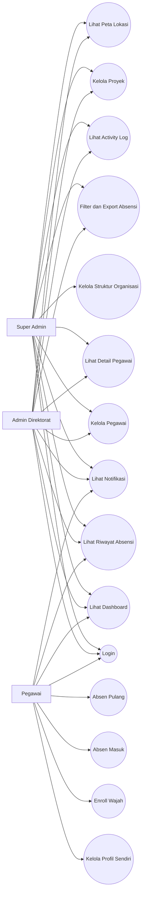

# Use Case Diagram Komdigi HRIS

## Aktor

- `Super Admin`
- `Admin Direktorat`
- `Pegawai`

## Diagram

## Penjelasan Use Case

### Super Admin

Super Admin merupakan aktor dengan akses tertinggi. Ia dapat melihat seluruh data lintas direktorat, mengelola pegawai, memantau absensi, mengakses activity log, dan memantau notifikasi sistem.

### Admin Direktorat

Admin Direktorat hanya dapat bekerja dalam scope direktoratnya sendiri. Ia dapat mengelola pegawai pada direktorat tersebut, memantau absensi, dan melihat notifikasi serta activity log yang relevan.

### Pegawai

Pegawai berfokus pada data pribadi. Ia dapat login, melihat dashboard pribadi, memperbarui profil, melakukan enroll wajah, absen masuk, absen pulang, dan melihat riwayat absensinya sendiri.
