# Dokumentasi Diagram Sistem SIPADI V2

Dokumen ini berisi gambar diagram dan kode sumber Mermaid untuk arsitektur sistem, use case, activity diagram, sequence diagram, dan Entity Relationship Diagram (ERD) dari sistem **SIPADI V2** (Sistem Pengarsipan dan Disposisi Inspektorat).

> [!NOTE]
> Diagram ditampilkan langsung oleh GitHub dari kode Mermaid. Versi gambar yang sudah tersedia disimpan di direktori `diagrams/`.

---

## 1. Arsitektur Sistem (System Architecture)

### Kode Sumber Mermaid:
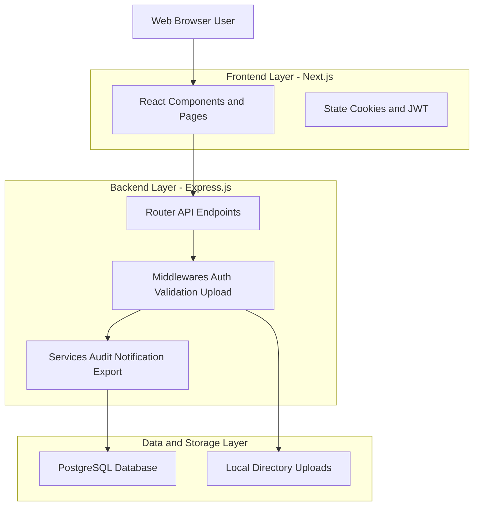

---

## 2. Use Case Diagram

### Gambar Diagram:
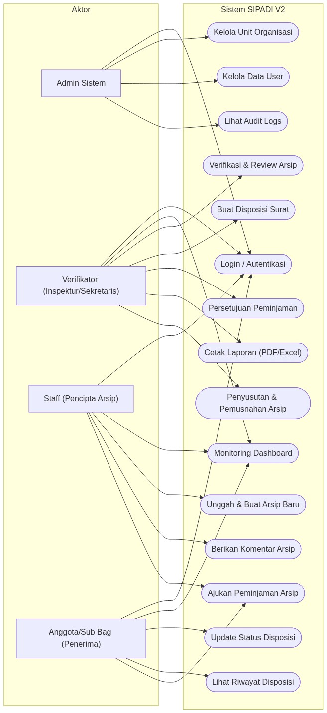

### Kode Sumber Mermaid:
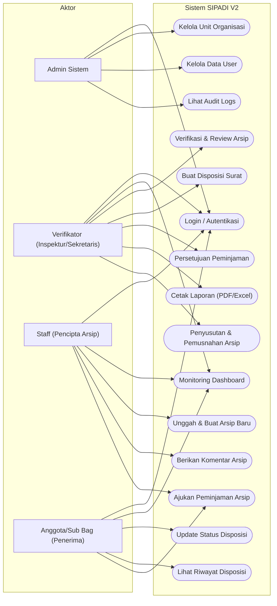

---

## 3. Activity Diagram Login

### Kode Sumber Mermaid:
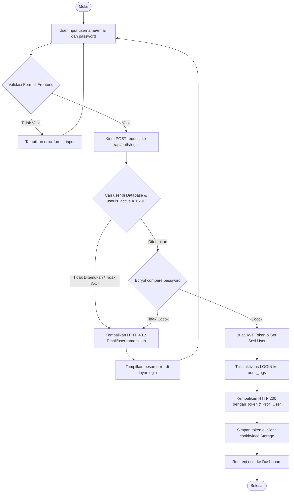

---

## 4. Activity Diagram Arsip (Archive Management Workflow)

### Kode Sumber Mermaid:
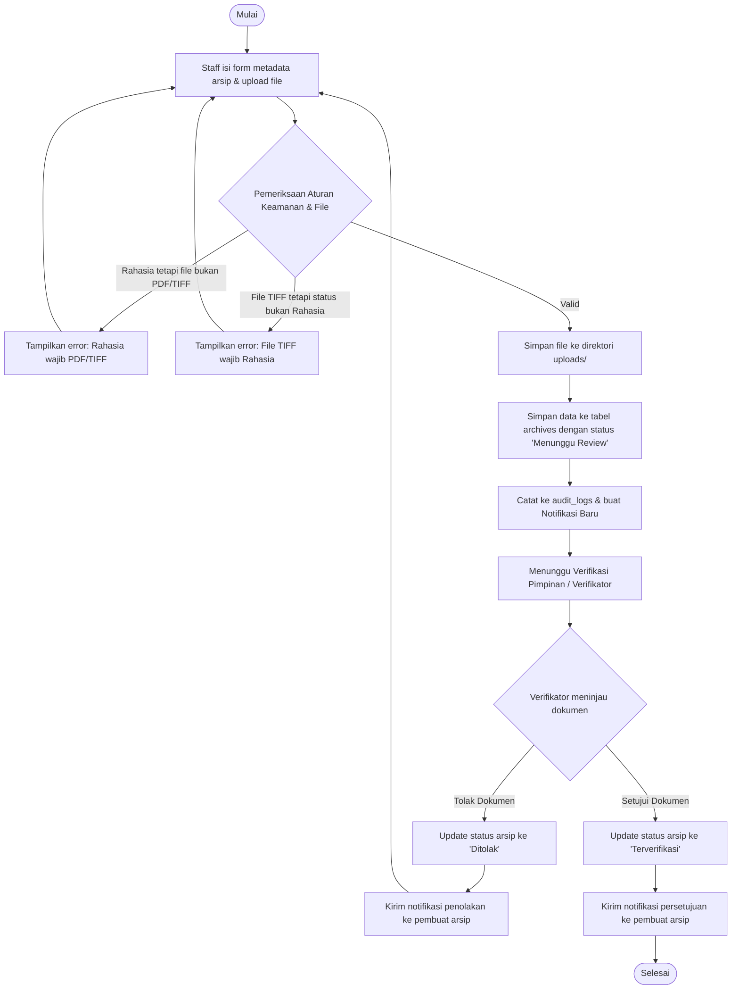

---

## 5. Activity Diagram Disposisi (Disposition Workflow)

### Gambar Diagram:
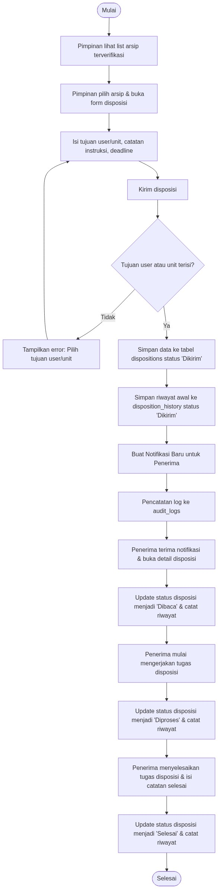

### Kode Sumber Mermaid:
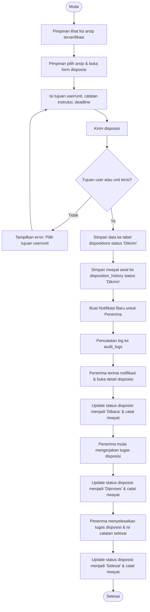

---

## 6. Sequence Diagram Login

### Gambar Diagram:
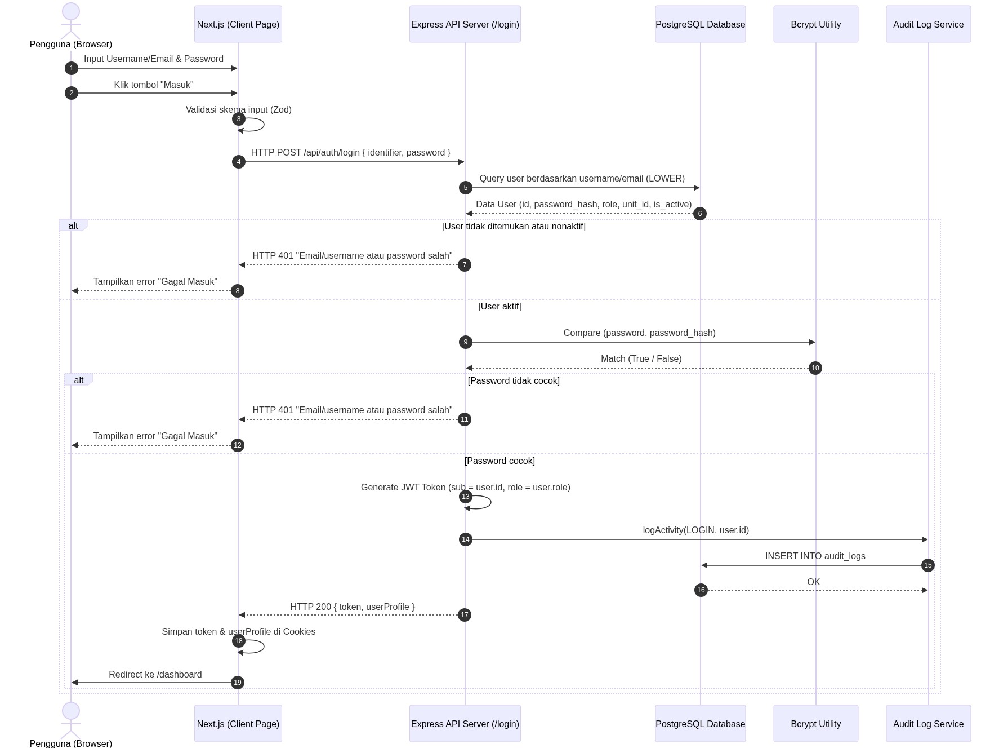

### Kode Sumber Mermaid:
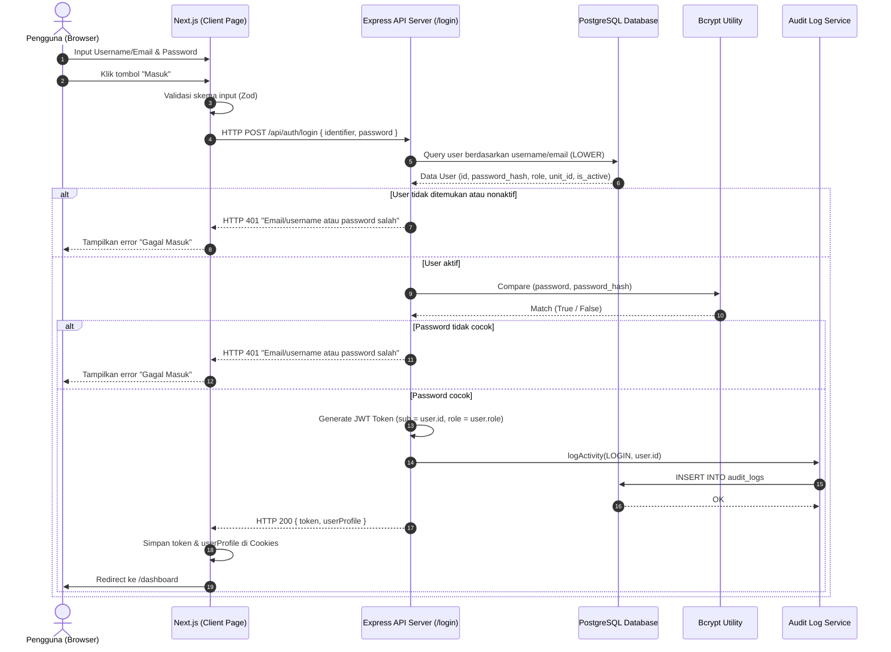

---

## 7. Sequence Diagram Disposisi (Disposition Flow)

### Gambar Diagram:

### Kode Sumber Mermaid:
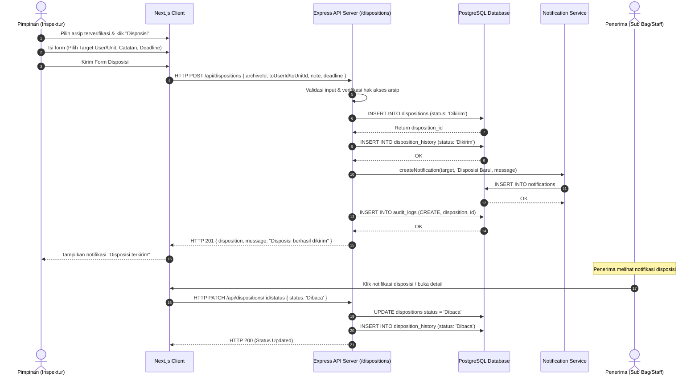

---

## 8. Entity Relationship Diagram (ERD)

### Gambar Diagram:
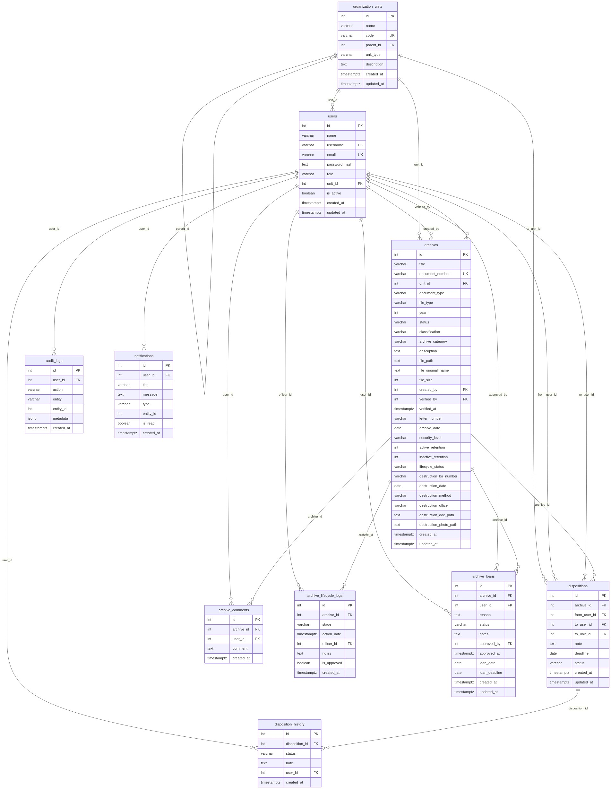

### Kode Sumber Mermaid:
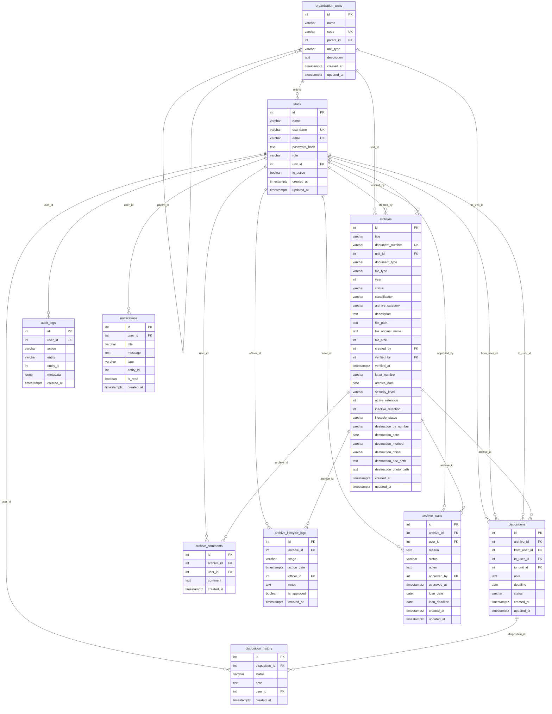
